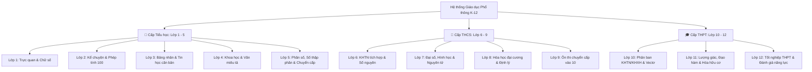

# 🎓 Ma trận Khung Chương trình K-12 & Ứng dụng AI

Chào mừng bạn đến với **Trung tâm Quản lý Khung Chương trình Phổ thông K-12 (AI4Edu Matrix)**. Hệ thống được thiết kế đồng bộ theo chuẩn **Chương trình Giáo dục Phổ thông 2018 (CTGDPT 2018)** của Bộ Giáo dục & Đào tạo Việt Nam, tích hợp các mô hình Trí tuệ Nhân tạo thế hệ mới (Generative AI & Gemini API).

---

## 🏛️ 1. Cấu trúc Phân cấp 3 Cấp học & 12 Khối lớp



---

## 📊 2. Bảng Tra cứu Nhanh 12 Khối Lớp

| Cấp học | Khối lớp | Môn học Trọng tâm | Định hướng AI & Phương pháp Sư phạm | Tài liệu Chi tiết |
| :--- | :--- | :--- | :--- | :--- |
| **Tiểu học** | **Lớp 1** | Toán, Tiếng Việt, TN&XH | Trò chơi hóa (Gamification), nhận diện chữ, câu đố vui | [Xem Lớp 1 →](/curriculum/primary/grade-1) |
| **Tiểu học** | **Lớp 2** | Toán, Tiếng Việt, Tiếng Anh | Phép tính 100 có nhớ, đọc hiểu đoạn ngắn, phản xạ ngoại ngữ | [Xem Lớp 2 →](/curriculum/primary/grade-2) |
| **Tiểu học** | **Lớp 3** | Toán, Tiếng Việt, Tin học & CN | Bảng cửu chương, so sánh/nhân hóa, an toàn số | [Xem Lớp 3 →](/curriculum/primary/grade-3) |
| **Tiểu học** | **Lớp 4** | Toán, Tiếng Việt, Khoa học, Sử-Địa | Phân số, văn miêu tả, thí nghiệm khoa học giả lập | [Xem Lớp 4 →](/curriculum/primary/grade-4) |
| **Tiểu học** | **Lớp 5** | Toán, Tiếng Việt, Khoa học | Số thập phân, văn tả cảnh, kỹ năng tự học chuyển cấp | [Xem Lớp 5 →](/curriculum/primary/grade-5) |
| **THCS** | **Lớp 6** | Toán, Ngữ văn, KHTN, Sử-Địa | KHTN tích hợp, Số nguyên, văn tự sự, phương pháp Socratic | [Xem Lớp 6 →](/curriculum/lower-secondary/grade-6) |
| **THCS** | **Lớp 7** | Toán, Ngữ văn, KHTN | Số hữu tỉ, Bảng tuần hoàn, suy luận hình học | [Xem Lớp 7 →](/curriculum/lower-secondary/grade-7) |
| **THCS** | **Lớp 8** | Toán, Ngữ văn, KHTN | Hằng đẳng thức, Acid/Base, văn nghị luận đời sống | [Xem Lớp 8 →](/curriculum/lower-secondary/grade-8) |
| **THCS** | **Lớp 9** | Toán, Ngữ văn, KHTN | Căn thức, Phương trình bậc 2, chiến lược giải đề thi vào 10 | [Xem Lớp 9 →](/curriculum/lower-secondary/grade-9) |
| **THPT** | **Lớp 10** | Toán, Văn, Lý, Hóa, Sinh | Vectơ, 3 Định luật Newton, Phản ứng Oxi hóa - Khử | [Xem Lớp 10 →](/curriculum/upper-secondary/grade-10) |
| **THPT** | **Lớp 11** | Toán, Văn, Lý, Hóa, Sinh | Lượng giác, Đạo hàm, Dao động & Sóng, Hóa hữu cơ | [Xem Lớp 11 →](/curriculum/upper-secondary/grade-11) |
| **THPT** | **Lớp 12** | Toán, Văn, Lý, Hóa, Sinh | Khảo sát hàm số, Tích phân, Oxyz, Luyện thi TN THPT & ĐGNL | [Xem Lớp 12 →](/curriculum/upper-secondary/grade-12) |

---

## ⚡ 3. Sử dụng AI4Edu Engine qua Dòng lệnh (CLI)

Hệ thống cung cấp sẵn công cụ CLI tương tác trực tiếp với toàn bộ 12 khối lớp:

```powershell
# Xem danh mục 12 lớp và môn học
python -m ai4edu.cli list-grades

# Tự động tạo giáo án 5E chuẩn cho môn học bất kỳ
python -m ai4edu.cli plan --grade 6 --subject natural_sciences --topic "Sự nở vì nhiệt của chất rắn"

# Trò chuyện với AI Socratic Tutor tùy biến theo lứa tuổi
python -m ai4edu.cli tutor --grade 1 --subject math --message "Em không hiểu phép cộng 4 + 3"
```
