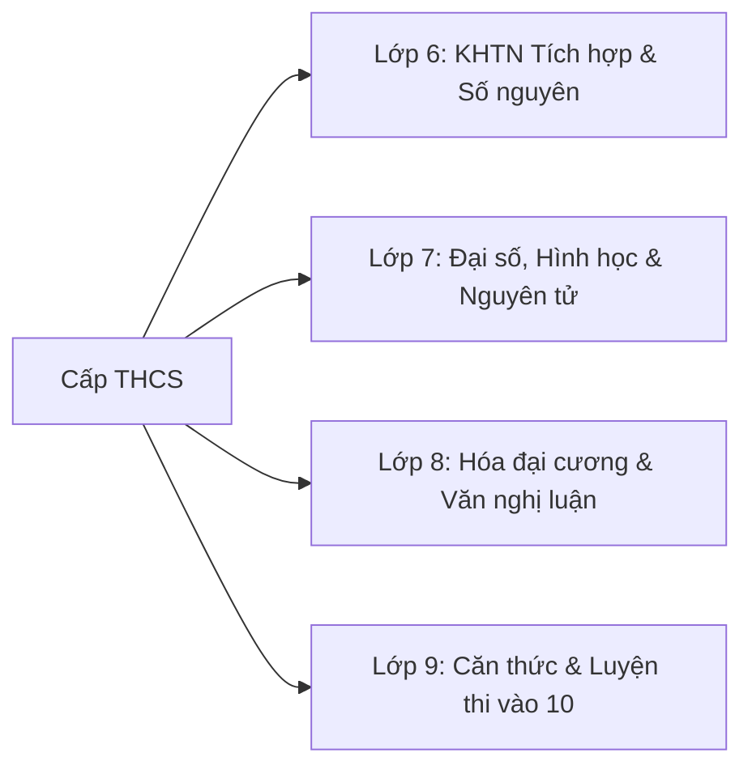

# 📘 Ứng dụng AI trong Cấp THCS (Lớp 6 - 9)

Cấp Trung học Cơ sở (11 - 15 tuổi) là giai đoạn học sinh bắt đầu hình thành **tư duy trừu tượng, tư duy logic phản biện** và tiếp cận các môn học tích hợp sâu như Khoa học Tự nhiên (Lý - Hóa - Sinh), Lịch sử & Địa lí, Ngữ văn phân tích và Toán đại số / hình học suy luận.

---

## 🧭 Khối Lớp & Định Hướng Sư Phạm

### 1. [Khối Lớp 6 →](/curriculum/lower-secondary/grade-6)
* **Trọng tâm:** Tập hợp số nguyên, KHTN tích hợp (các thể của chất, tế bào, lực & năng lượng), văn tự sự.
* **Kịch bản AI:** Trợ lý Socratic gợi mở tư duy khoa học, mô phỏng các hiện tượng chuyển thể chất.

### 2. [Khối Lớp 7 →](/curriculum/lower-secondary/grade-7)
* **Trọng tâm:** Số hữu tỉ, số thực, nguyên tử và bảng tuần hoàn các nguyên tố, tam giác bằng nhau.
* **Kịch bản AI:** Sinh hình vẽ hình học, phân tích cấu tạo electron nguyên tử, hỗ trợ đọc hiểu thơ 4-5 chữ.

### 3. [Khối Lớp 8 →](/curriculum/lower-secondary/grade-8)
* **Trọng tâm:** Hằng đẳng thức, phân thức đại số, phản ứng hóa học (mol, nồng độ), định lý Thalès, văn nghị luận đời sống.
* **Kịch bản AI:** Kiểm tra cân bằng phương trình hóa học, gợi ý lập luận logic cho bài văn nghị luận xã hội.

### 4. [Khối Lớp 9 →](/curriculum/lower-secondary/grade-9)
* **Trọng tâm:** Căn thức, phương trình bậc hai, hệ thức lượng đường tròn, hóa vô cơ & hữu cơ đại cương, văn học trung đại/hiện đại.
* **Kịch bản AI:** Trợ lý luyện giải đề thi vào 10, phân tích lỗi sai điển hình, chấm bài văn theo Rubric Bộ GD&ĐT.
