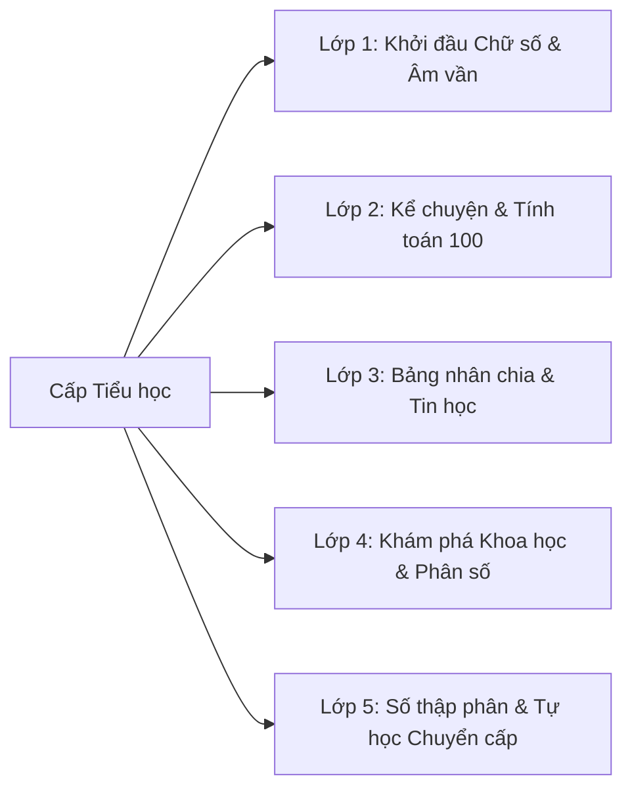

# 🎒 Ứng dụng AI trong Cấp Tiểu học (Lớp 1 - 5)

Giáo dục Tiểu học (6 - 11 tuổi) là giai đoạn nền tảng hình thành nhân cách, kỹ năng đọc - viết - tính toán và thói quen kỷ luật học tập. Ở cấp học này, ứng dụng AI cần lấy **học sinh làm trung tâm**, kết hợp **trò chơi hóa (Gamification)**, hình ảnh sinh động và **ngôn ngữ ấm áp, động viên**.

---

## 🧭 Khối Lớp & Định Hướng Sư Phạm

### 1. [Khối Lớp 1 →](/curriculum/primary/grade-1)
* **Trọng tâm:** Nhận diện chữ cái, ghép vần, đếm số 1-100, hình học trực quan.
* **Kịch bản AI:** Thơ vần ghép chữ, câu đố hoạt hình, khen thưởng bằng biểu tượng vui.

### 2. [Khối Lớp 2 →](/curriculum/primary/grade-2)
* **Trọng tâm:** Cộng trừ có nhớ trong phạm vi 100, đọc hiểu đoạn văn ngắn 3-5 câu.
* **Kịch bản AI:** Đố vui toán có lời văn dạng câu chuyện ngụ ngôn, trợ lý phát âm tiếng Anh cơ bản.

### 3. [Khối Lớp 3 →](/curriculum/primary/grade-3)
* **Trọng tâm:** Bảng cửu chương 6-9, số đến 100.000, biện pháp tu từ so sánh/nhân hóa, làm quen máy tính.
* **Kịch bản AI:** Trò chơi thử thách ghi nhớ bảng nhân, gợi ý so sánh sinh động khi tập làm văn.

### 4. [Khối Lớp 4 →](/curriculum/primary/grade-4)
* **Trọng tâm:** Phân số, văn miêu tả con vật/cây cối, khoa học tự nhiên (nước, không khí, nhiệt độ).
* **Kịch bản AI:** Sinh sơ đồ tư duy phân số, đóng vai nhân vật trong lịch sử, gợi ý dàn ý bài văn.

### 5. [Khối Lớp 5 →](/curriculum/primary/grade-5)
* **Trọng tâm:** Số thập phân, tỉ số phần trăm, văn tả cảnh/người, chuẩn bị chuyển cấp sang THCS.
* **Kịch bản AI:** Phân tích lỗi tính toán số thập phân, hướng dẫn lập kế hoạch ôn tập chuyển cấp.

---

## 🛡️ Nguyên Tắc An Toàn & Đạo Đức AI Cho Tiểu Học

> [!IMPORTANT]
> **Giới hạn thời lượng & tương tác:** Trẻ tiểu học chỉ nên tương tác với công cụ số dưới sự đồng hành của giáo viên hoặc phụ huynh. AI không bao giờ thay thế các hoạt động vận động thể chất, viết tay và thực hành đồ dùng học tập.
