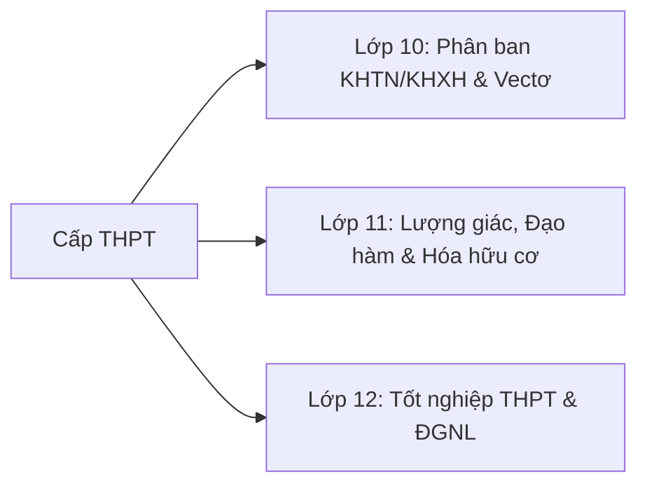

# 🎓 Ứng dụng AI trong Cấp THPT (Lớp 10 - 12)

Cấp Trung học Phổ thông (15 - 18 tuổi) là giai đoạn giáo dục định hướng nghề nghiệp, phát triển **tư duy phản biện, tư duy mô hình hóa toán học và năng lực học tập độc lập**. Ứng dụng AI ở cấp học này tập trung vào giải quyết các bài toán phức hợp, nghiên cứu khoa học và luyện thi Tốt nghiệp THPT / Đánh giá năng lực (ĐGNL) / Đánh giá tư duy (ĐGTD).

---

## 🧭 Khối Lớp & Định Hướng Sư Phạm

### 1. [Khối Lớp 10 →](/curriculum/upper-secondary/grade-10)
* **Trọng tâm:** Vectơ, phương pháp tọa độ Oxy, 3 Định luật Newton, phản ứng oxi hóa - khử, cấu trúc tế bào.
* **Kịch bản AI:** Mô hình hóa hiện tượng vật lí bằng Python, phân tích cơ chế phản ứng redox.

### 2. [Khối Lớp 11 →](/curriculum/upper-secondary/grade-11)
* **Trọng tâm:** Hàm số lượng giác, cấp số cộng/nhân, đạo hàm cơ bản, dao động & sóng cơ, hóa hữu cơ đại cương.
* **Kịch bản AI:** Trợ lý giải toán đạo hàm từng bước, phân tích cấu trúc đồng phân hữu cơ.

### 3. [Khối Lớp 12 →](/curriculum/upper-secondary/grade-12)
* **Trọng tâm:** Ứng dụng đạo hàm khảo sát hàm số, nguyên hàm - tích phân, hình học không gian Oxyz, hóa học polymer & phức chất, di truyền phân tử.
* **Kịch bản AI:** Hệ thống sinh đề thi thử trắc nghiệm 4 định dạng mới của Bộ GD&ĐT (Trắc nghiệm nhiều lựa chọn, Trắc nghiệm Đúng/Sai, Trắc nghiệm Trả lời ngắn).
