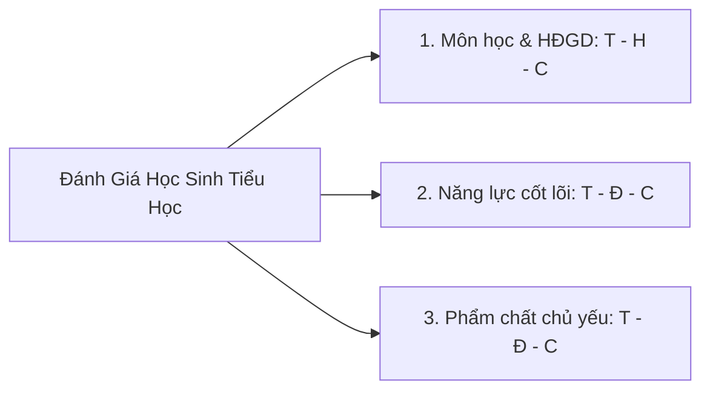

# 📊 Chuyên Đề 3: Đánh Giá & Viết Nhận Xét Học Sinh (Thông Tư 27/2020/TT-BGDĐT)

Đánh giá học sinh tiểu học theo **Thông tư 27/2020/TT-BGDĐT** là quá trình thu thập thông tin nhằm **định hình sự tiến bộ của học sinh**, tránh gây áp lực điểm số và phán xét tiêu cực. AI hỗ trợ giáo viên Trường Hoàng Mai viết những lời nhận xét chi tiết, có căn cứ, mang tính khích lệ cao và tự động phát hiện lỗ hổng kiến thức từ dữ liệu Excel.

---

## 🏛️ 1. Ba Trụ Cột Đánh Giá Chuẩn Thông Tư 27/2020



1. **Đánh giá về Môn học & Hoạt động giáo dục:**
   * **Hoàn thành tốt (T):** Nắm vững kiến thức, vận dụng sáng tạo, tự giải quyết vấn đề.
   * **Hoàn thành (H):** Đạt chuẩn kiến thức kỹ năng theo quy định.
   * **Chưa hoàn thành (C):** Chưa đạt chuẩn, cần giáo viên hướng dẫn và giúp đỡ thêm.
2. **Đánh giá về Năng lực cốt lõi:**
   * Năng lực chung: *Tự chủ & tự học, Giao tiếp & hợp tác, Giải quyết vấn đề & sáng tạo*.
   * Năng lực đặc thù: *Ngôn ngữ, Tính toán, Khoa học, Tin học, Công nghệ, Thẩm mỹ, Thể chất*.
3. **Đánh giá về Phẩm chất chủ yếu:**
   * *Yêu nước, Nhân ái, Chăm chỉ, Trung thực, Trách nhiệm*.

---

## 🛡️ 2. Nguyên Tắc An Toàn Dữ Liệu & Ẩn Danh (Data De-identification)

> [!CAUTION]
> **Tuyệt đối không đưa thông tin nhạy cảm của học sinh lên các công cụ AI công cộng.**
> * **Trước khi nạp bảng điểm Excel:** Xóa các cột: Họ tên khai sinh đầy đủ, Ngày tháng năm sinh, Địa chỉ nhà, Số điện thoại phụ huynh.
> * **Thay thế bằng Mã ẩn danh:** `HS01`, `HS02`, `HS_A`, `HS_B`.

---

## 💡 3. Thư Viện Prompt Đánh Giá & Nhận Xét

### 3.1. Viết nhận xét sổ theo dõi định kỳ cá nhân hóa

```text
Bạn là Giáo viên Tiểu học tại Trường Hoàng Mai. Hãy viết nhận xét cuối học kì I chuẩn Thông tư 27/2020 cho học sinh:
- Mã học sinh: HS08 (Lớp 3A)
- Ghi chú thực tế của giáo viên: 'Môn Toán làm bài nhanh, tính nhẩm tốt nhưng đôi khi còn ẩu ở phép trừ có nhớ. Môn Tiếng Việt đọc to, viết chữ nắn nót, tích cực phát biểu xây dựng bài. Trong giờ học nhóm luôn hòa đồng và biết giúp đỡ bạn bên cạnh.'

Yêu cầu:
1. Đánh giá Môn học (Toán, Tiếng Việt): Nêu điểm nổi bật và 1 biện pháp khắc phục cụ thể, nhẹ nhàng.
2. Đánh giá Năng lực (Tự chủ - Tự học, Giao tiếp - Hợp tác): Nêu dẫn chứng cụ thể.
3. Đánh giá Phẩm chất (Chăm chỉ, Nhân ái).
4. Viết 1 đoạn nhận xét tổng quát 3-4 câu gửi phụ huynh mang tính động viên, chân thành và tôn trọng.
```

### 3.2. Phân tích ma trận lỗi sai từ bảng điểm Excel

```text
Dưới đây là thống kê kết quả bài kiểm tra giữa kì môn Toán Lớp 4 (đã ẩn danh):
- HS01 - HS10: Làm tốt câu 1, 2, 3 (cộng trừ phân số), nhưng 70% sai ở câu 4 (bài toán tìm phân số của một số).
- HS11 - HS20: Sai ở bước rút gọn phân số về phân số tối giản.

Hãy:
1. Phân tích nguyên nhân gốc rễ học sinh hay nhầm lẫn ở dạng bài này.
2. Đề xuất 3 hoạt động trực quan trong tiết chữa bài để giúp học sinh khắc phục triệt để.
```

---

## ⚡ 4. Chạy Thử Trên AI4Edu CLI

```powershell
python -m ai4edu.cli review-tt27 --grade 3 --subject vietnamese --alias "HS08" --notes "Đọc to, diễn cảm, chữ viết đều đẹp, cần rèn thêm cách dùng từ gợi cảm khi viết đoạn văn"
```
