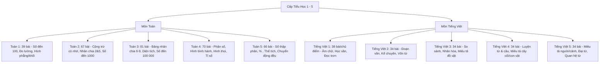

# 📑 Mục Lục Toàn Diện SGK Toán & Tiếng Việt Lớp 1 - 5

> **Trường Tiểu học Hoàng Mai • Kế hoạch Giáo dục Nhà trường**  
> **Bộ Sách:** *Kết nối tri thức với cuộc sống (Nhà xuất bản Giáo dục Việt Nam)*  
> **Chương trình Giáo dục Phổ thông 2018 (CTGDPT 2018)**  
> **Tác giả:**
> - **Môn Toán:** GS.TSKH. Hà Huy Khoái (Tổng Chủ biên), PGS.TS. Lê Anh Vinh (Chủ biên).
> - **Môn Tiếng Việt:** GS.TS. Bùi Mạnh Hùng (Tổng Chủ biên).

---

## 🧭 Ma Trận Tổng Quan Cấp Tiểu Học

---

## 🧸 1. Khối Lớp 1

### 📐 Sách Giáo Khoa Toán 1 (39 Bài Học)
* **Tập 1:**
  - *Chủ đề 1: Các số từ 0 đến 10:* Bài 1: Tiết học đầu tiên • Bài 2: Các số 0, 1, 2, 3, 4, 5 • Bài 3: Các số 6, 7, 8, 9, 10 • Bài 4: Nhiều hơn, ít hơn, bằng nhau • Bài 5: Mấy và mấy • Bài 6: Luyện tập chung.
  - *Chủ đề 2: Làm quen hình phẳng:* Bài 7: Hình vuông, hình tròn, hình tam giác, hình chữ nhật • Bài 8: Thực hành lắp ghép, xếp hình • Bài 9: Luyện tập chung.
  - *Chủ đề 3: Phép cộng, phép trừ trong phạm vi 10:* Bài 10: Phép cộng trong phạm vi 10 • Bài 11: Bảng cộng trong phạm vi 10 • Bài 12: Bảng trừ trong phạm vi 10 • Bài 13 & 14: Luyện tập chung.
  - *Chủ đề 4: Làm quen hình khối:* Bài 15: Vị trí, định hướng trong không gian • Bài 16: Khối lập phương, khối hộp chữ nhật • Bài 17: Ôn tập Học kì I.
* **Tập 2:**
  - *Chủ đề 5 & 6: Các số trong phạm vi 20 & 100:* Bài 18: Các số từ 11 đến 20 • Bài 19: Phép cộng trừ không nhớ phạm vi 20 • Bài 21: Số tròn chục • Bài 22: Số có 2 chữ số • Bài 23: So sánh số.
  - *Chủ đề 7 & 8: Đo độ dài & Phép tính không nhớ phạm vi 100:* Bài 25: Dài hơn, ngắn hơn • Bài 26: Xăng-ti-mét • Bài 29 - 33: Phép cộng, phép trừ số có 2 chữ số.
  - *Chủ đề 9 & 10: Thời gian & Ôn tập cuối năm:* Bài 34: Xem đồng hồ, lịch • Bài 35: Các ngày trong tuần • Bài 36 - 39: Ôn tập tổng kết cuối năm.

### 📖 Sách Giáo Khoa Tiếng Việt 1 (38 Bài Học)
* **Tập 1 (Học Âm chữ & Vần):** Bài 1: A a, B b • Bài 2: C c, O o, Dấu sắc • Bài 3: D d, Đ đ, Dấu huyền • Bài 4: E e, Ê ê • Bài 6: G g, H h • Bài 7: I i, K k • Bài 8: L l, M m • Bài 9: N n, Ô ô • Bài 11: Ơ ơ, P p • Bài 12: Q q, R r • Bài 13: S s, T t • Bài 14: U u, Ư ư • Bài 15: V v, X x, Y y • Bài 17 - 20: Các vần an, at, am, ap, ang, ac và Ôn tập Học kì I.
* **Tập 2 (Luyện đọc theo 8 Chủ điểm):** 
  - *Tôi và các bạn:* Tôi là học sinh lớp 1, Đôi tai xấu xí, Bạn của gió.
  - *Mái ấm gia đình:* Làm anh, Quạt cho bà ngủ, Bữa cơm gia đình.
  - *Mái trường mến yêu:* Tôi đi học, Giờ ra chơi, Hoa yêu thương.
  - *Điều em cần biết:* Rửa tay trước khi ăn, Lời chào, Đèn giao thông.
  - *Bài học từ cuộc sống & Thiên nhiên kì thú:* Kiến và chim bồ câu, Chú bé chăn cừu, Cây bàng, Mặt trời và hạt đỗ, Bác Hồ kính yêu.

---

## 🎒 2. Khối Lớp 2

### 📐 Sách Giáo Khoa Toán 2 (67 Bài Học)
* **Tập 1 (Bài 1 - 35):**
  - *Chủ đề 1 & 2: Ôn tập & Phép cộng trừ qua 10 phạm vi 20:* Bài 1: Ôn tập số đến 100 • Bài 2: Tia số, số liền trước/sau • Bài 3: Thành phần phép cộng trừ • Bài 7: Phép cộng (qua 10) • Bài 8: Bảng cộng qua 10 • Bài 11: Phép trừ qua 10 • Bài 12: Bảng trừ qua 10.
  - *Chủ đề 3 & 4: Hình phẳng & Phép tính có nhớ phạm vi 100:* Bài 15: Điểm, đoạn thẳng • Bài 16: Đường gấp khúc • Bài 19 - 25: Cộng trừ có nhớ số có hai chữ số.
  - *Chủ đề 5, 6, 7: Đại lượng & Ôn tập Học kì I:* Bài 26: Ki-lô-gam • Bài 27: Lít • Bài 30: Ngày - giờ, giờ - phút • Bài 31: Ngày - tháng • Bài 33 - 35: Ôn tập Học kì I.
* **Tập 2 (Bài 36 - 67):**
  - *Chủ đề 8 & 9: Phép nhân chia & Hình khối:* Bài 36: Phép nhân, thừa số, tích • Bài 37 & 38: Bảng nhân 2, 5 • Bài 39 & 40: Bảng chia 2, 5 • Bài 41: Số bị chia, số chia, thương • Bài 43: Khối trụ, khối cầu.
  - *Chủ đề 10 & 11: Số đến 1000 & Đo lường:* Bài 46: Đơn vị, chục, trăm, nghìn • Bài 47: Số có ba chữ số • Bài 51: Đề-xi-mét, Mét, Ki-lô-mét • Bài 53: Tiền Việt Nam.
  - *Chủ đề 12, 13, 14: Phép tính phạm vi 1000, Thống kê & Ôn tập cuối năm:* Bài 55 - 59: Cộng trừ có nhớ phạm vi 1000 • Bài 60: Thu thập số liệu • Bài 61: Biểu đồ tranh • Bài 62: Chắc chắn, có thể, không thể • Bài 63 - 67: Ôn tập tổng hợp.

### 📖 Sách Giáo Khoa Tiếng Việt 2 (34 Bài Học)
* **Tập 1 (Chủ điểm 1 đến 4):**
  - *Em lớn lên từng ngày:* Tôi là học sinh lớp 2, Ngày hôm qua đâu rồi, Niềm vui của Bi và Bống, Làm việc thật là vui.
  - *Đi học vui sao:* Cầu thủ dự bị, Cô giáo lớp em, Nhím nâu kết bạn, Em học vẽ.
  - *Niềm vui tuổi thơ:* Cuốn sách của em, Yêu lắm trường ơi, Chữ A và những người bạn, Họa mi hót.
  - *Mái ấm gia đình:* Mẹ, Quả ngọt cuối mùa, Bà nội bà ngoại, Đi học về.
* **Tập 2 (Chủ điểm 5 đến 8):**
  - *Vẻ đẹp quanh em:* Chuyện bốn mùa, Mùa nước nổi, Hạt đỗ nảy mầm, Cây đào.
  - *Hành tinh xanh của em:* Lá thư dưới đáy biển, Cây đa quê hương, Mai An Tiêm, Thư viện chim sâu.
  - *Giao tiếp và kết nối:* Cảm ơn và xin lỗi, Lời chào, Đôi bạn tay, Thư viện của em.
  - *Con người Việt Nam:* Thánh Gióng, Hai Bà Trưng, Đất nước gấm hoa, Bác Hồ với thiếu nhi.

---

## 📘 3. Khối Lớp 3

### 📐 Sách Giáo Khoa Toán 3 (81 Bài Học)
* **Tập 1 (Bài 1 - 44):**
  - *Chủ đề 1 & 2: Ôn tập & Bảng nhân chia 6, 7, 8, 9:* Bài 1 - 8: Ôn tập số đến 1000, bảng nhân chia 2-5 • Bài 9 - 12: Bảng nhân chia 6, 7, 8, 9 • Bài 13: Thành phần phép tính • Bài 14: Một phần mấy.
  - *Chủ đề 3 & 4: Hình phẳng, hình khối & Phép tính phạm vi 100:* Bài 16: Điểm ở giữa, trung điểm • Bài 17: Hình tròn, tâm, bán kính • Bài 18: Góc, góc vuông, góc không vuông • Bài 19: Hình tam giác, tứ giác, chữ nhật, vuông • Bài 21: Khối lập phương, hộp chữ nhật • Bài 23 - 29: Nhân chia 2 chữ số, Gấp/giảm số lần, Bài toán 2 bước tính.
  - *Chủ đề 5, 6, 7: Đo lường & Ôn tập Học kì I:* Bài 30: Mi-li-mét • Bài 31: Gam • Bài 32: Mi-li-lít • Bài 33: Nhiệt độ • Bài 36 - 40: Nhân chia 3 chữ số, Biểu thức số • Bài 41 - 44: Ôn tập HKI.
* **Tập 2 (Bài 45 - 81):**
  - *Chủ đề 8 & 9: Số đến 10 000 & Chu vi, diện tích:* Bài 45: Số có 4 chữ số • Bài 47: Số La Mã • Bài 48: Làm tròn số • Bài 50: Chu vi tam giác, tứ giác, chữ nhật, vuông • Bài 51: Diện tích, $cm^2$ • Bài 52: Diện tích hình chữ nhật & hình vuông.
  - *Chủ đề 10 - 13: Phép tính phạm vi 10 000 & 100 000:* Bài 54 - 58: Cộng trừ nhân chia phạm vi 10 000 • Bài 59: Tiền Việt Nam • Bài 60 - 68: Số và phép tính trong phạm vi 100 000.
  - *Chủ đề 14 - 16: Đồng hồ, Thống kê & Ôn tập cuối năm:* Bài 69: Xem đồng hồ, tháng năm • Bài 71: Bảng số liệu • Bài 72: Khả năng xảy ra của sự kiện • Bài 74 - 79: Ôn tập cuối năm.

### 📖 Sách Giáo Khoa Tiếng Việt 3 (34 Bài Học)
* **Tập 1 (Chủ điểm 1 đến 4):**
  - *Những búp măng non:* Ngày em vào Đội, Về thăm quê, Chiếc nhãn vở đặc biệt, Lời giải toán đặc biệt.
  - *Mái trường thân yêu:* Mùa thu của em, Nghe thầy đọc thơ, Đi học vui sao, Lớp học trên đường.
  - *Cổng trường mở ra:* Bàn tay cô giáo, Cùng vui chơi, Bác bảo vệ trường em, Tiếng trống trường.
  - *Gia đình yêu thương:* Quạt cho bà ngủ, Con yêu mẹ, Mẹ của Đỗ, Bàn tay mẹ.
* **Tập 2 (Chủ điểm 5 đến 8):**
  - *Đất nước ngàn năm:* Đất nước, Hai Bà Trưng, Người đi săn và con vượn, Sự tích Hồ Gươm.
  - *Trái Đất của chúng mình:* Mưa, Cơn mưa rào, Bầu trời mùa thu, Mặt Trời xanh của tôi.
  - *Nghệ thuật và cuộc sống:* Hát bội, Tiếng đàn Ba-la-lai-ca trên sông Đà, Nhà bác học và bà cụ.
  - *Ngôi nhà chung:* Bác sĩ Y-éc-xanh, Chuyện ở đảo Trường Sa, Con suối nhỏ, Cây đa làng.

---

## 🔬 4. Khối Lớp 4

### 📐 Sách Giáo Khoa Toán 4 (70 Bài Học)
* **Tập 1 (Bài 1 - 35):**
  - *Chủ đề 1 & 2: Số đến 100 000 & Góc:* Bài 1 - 6: Số chẵn lẻ, Biểu thức chứa chữ, Bài toán 3 bước tính • Bài 7: Đo góc, độ • Bài 8: Góc nhọn, góc tù, góc bẹt.
  - *Chủ đề 3 & 4: Số có nhiều chữ số & Đại lượng:* Bài 10: Hàng và lớp • Bài 11: Lớp triệu • Bài 14: Làm tròn số • Bài 16: Yến, tạ, tấn • Bài 17: Giây, thế kỉ.
  - *Chủ đề 5 - 8: Phép tính, Hình học & Ôn tập HKI:* Bài 19 - 23: Cộng trừ số có nhiều chữ số, Tìm 2 số khi biết Tổng - Hiệu • Bài 24 - 27: Hai đường thẳng vuông góc, song song • Bài 28 - 32: Nhân chia số có 2 chữ số • Bài 33 - 35: Ôn tập HKI.
* **Tập 2 (Bài 36 - 70):**
  - *Chủ đề 9, 10, 11: Phân số & Bốn phép tính phân số:* Bài 36: Khái niệm phân số • Bài 38: Tính chất cơ bản • Bài 39: Rút gọn • Bài 40: Quy đồng • Bài 41 & 42: So sánh phân số • Bài 44 - 53: Cộng, trừ, nhân, chia phân số, Tìm phân số của một số.
  - *Chủ đề 12, 13, 14: Hình bình hành, Hình thoi, Diện tích & Tỉ số:* Bài 54 & 55: Hình bình hành và Diện tích • Bài 56 & 57: Hình thoi và Diện tích • Bài 59: $dm^2, m^2, mm^2$ • Bài 61: Tỉ số • Bài 62: Tìm 2 số biết Tổng và Tỉ số • Bài 63: Tìm 2 số biết Hiệu và Tỉ số.
  - *Chủ đề 15 & 16: Biểu đồ cột & Ôn tập cuối năm:* Bài 65: Biểu đồ cột • Bài 66: Số lần xuất hiện của sự kiện • Bài 67 - 70: Ôn tập cuối năm.

### 📖 Sách Giáo Khoa Tiếng Việt 4 (34 Bài Học)
* **Tập 1 (Chủ điểm 1 đến 4):**
  - *Mỗi người một vẻ:* Thanh âm của gió, Cánh buồm tuổi thơ, Tuổi Ngựa, Người làm đồ chơi.
  - *Trải nghiệm và khám phá:* Nghệ sĩ trống, Chuỗi hạt ngọc, Bầu trời của em, Chuyến du lịch kì thú.
  - *Mái ấm gia đình:* Về thăm bà, Bàn tay mẹ, Hương ổi, Bức tranh của em gái tôi.
  - *Chắp cánh ước mơ:* Đôi cánh của ngựa trắng, Ước mơ của Sam, Bay cao ước mơ, Tuổi thơ em.
* **Tập 2 (Chủ điểm 5 đến 8):**
  - *Sống để yêu thương:* Người ăn xin, Con muốn làm một cái cây, Chiếc lá đầu tiên, Vì hòa bình.
  - *Uống nước nhớ nguồn:* Chiếc gáo dừa, Lời ru của mẹ, Danh y Tuệ Tĩnh, Bác Hồ làm việc.
  - *Quê hương trong tôi:* Gió đồng hun hút, Sông Hương, Đất nước ngàn năm, Làng sen.
  - *Vì một thế giới bình yên:* Hải âu bay trên biển, Trái Đất trẻ thơ, Tiếng chuông hòa bình, Vòng tay bạn bè.

---

## 🎓 5. Khối Lớp 5

### 📐 Sách Giáo Khoa Toán 5 (66 Bài Học)
* **Tập 1 (Bài 1 - 35):**
  - *Chủ đề 1 & 2: Phân số thập phân & Số thập phân:* Bài 1 - 5: Ôn tập phân số, Hỗn số • Bài 6: Khái niệm số thập phân • Bài 7: Hàng của số thập phân • Bài 9: So sánh số thập phân • Bài 10: Làm tròn • Bài 11 & 12: Viết số đo đại lượng, Héc-ta ($ha$).
  - *Chủ đề 3, 4, 5, 6: Phép tính số thập phân, Hình tam giác, Hình thang, Hình tròn:* Bài 14 - 27: Cộng, trừ, nhân, chia số thập phân • Bài 28: Diện tích hình tam giác • Bài 29: Diện tích hình thang • Bài 31 & 32: Chu vi và Diện tích hình tròn • Bài 34 & 35: Ôn tập HKI.
* **Tập 2 (Bài 36 - 66):**
  - *Chủ đề 7: Tỉ số phần trăm:* Bài 36: Tỉ số phần trăm • Bài 37: Tìm tỉ số % của hai số • Bài 38: Tìm giá trị % của một số • Bài 39: Tìm một số khi biết giá trị % • Bài 40: Sử dụng máy tính cầm tay.
  - *Chủ đề 8: Thể tích & Hình khối:* Bài 42: Hình hộp chữ nhật, lập phương • Bài 43 & 44: Diện tích xung quanh và toàn phần • Bài 45 & 46: $cm^3, dm^3, m^3$ • Bài 47: Thể tích hình hộp và lập phương.
  - *Chủ đề 9: Số đo thời gian & Toán chuyển động đều:* Bài 49 - 51: Cộng trừ nhân chia số đo thời gian • Bài 52: Vận tốc • Bài 53: Quãng đường • Bài 54: Thời gian ($v = s / t$) • Bài 55: Chuyển động ngược chiều/cùng chiều.
  - *Chủ đề 10 - 12: Biểu đồ quạt tròn & Ôn tập tốt nghiệp Tiểu học:* Bài 57: Biểu đồ quạt tròn • Bài 58: Xác suất thực nghiệm • Bài 60 - 66: Ôn tập toàn diện chuẩn bị chuyển cấp THCS.

### 📖 Sách Giáo Khoa Tiếng Việt 5 (34 Bài Học)
* **Tập 1 (Chủ điểm 1 đến 4):**
  - *Khởi đầu mới:* Bài ca Trái Đất, Buổi sáng ở quê nội, Ngày hội mừng năm học mới, Thư gửi các học sinh.
  - *Khám phá thế giới:* Vịnh Hạ Long, Kì quan thế giới, Du hành mặt trăng, Hành tinh xanh.
  - *Yêu thương và chia sẻ:* Tiếng rao đêm, Mùa hoa cải bên sông, Hạt gạo làng ta, Lòng dân.
  - *Cội nguồn yêu thương:* Thư thăm quê, Nghĩa thầy trò, Hạt giống tâm hồn, Đất nước.
* **Tập 2 (Chủ điểm 5 đến 8):**
  - *Giữ lấy màu xanh:* Kì quan rừng nhiệt đới, Tiếng đàn Ba-la-lai-ca trên sông Đà, Bài ca giữ đất, Trồng cây gây rừng.
  - *Vì cuộc sống bình yên:* Người gác rừng tí hon, Chú công an của em, Giữ gìn an ninh trật tự, Lập làng giữ biển.
  - *Con người và thời đại:* Nhà phát minh tương lai, Chinh phục vũ trụ, Trí tuệ nhân tạo và em, Thành phố thông minh.
  - *Việt Nam gấm vóc:* Đất nước hình tia chớp, Bác Hồ sống mãi với non sông, Việt Nam quê hương ta, Lời chào tạm biệt tiểu học.
