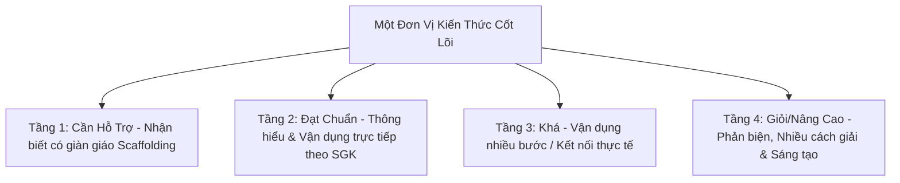

# 🎯 Chuyên Đề 2: Dạy Học Phân Hóa & Thiết Kế Nhiệm Vụ Cho Học Sinh Khá Giỏi

Trong mô hình trường chất lượng cao như **Trường Tiểu học Hoàng Mai**, việc dạy học đồng loạt một mức độ sẽ gây nhàm chán cho học sinh khá giỏi hoặc gây quá tải cho học sinh tiếp thu chậm. AI là công cụ đắc lực giúp giáo viên **từ 1 đơn vị kiến thức $\rightarrow$ phân tách thành 4 tầng nhiệm vụ học tập**.

---

## 📊 1. Ma Trận Phân Hóa 4 Tầng Năng Lực



| Tầng Phân Hóa | Nhóm Học Sinh | Mức độ Trợ giúp (Scaffolding) | Dạng Nhiệm vụ Tiêu biểu |
| :--- | :--- | :--- | :--- |
| **Tầng 1: Cần hỗ trợ** | Học sinh chậm, chưa tự tin | Tối đa: Kèm hình vẽ minh họa, điền khuyết, mẫu câu có sẵn | Nối hình, điền số còn thiếu vào sơ đồ, tính toán 1 bước |
| **Tầng 2: Đạt chuẩn** | Đa số học sinh trong lớp | Vừa phải: Gợi ý công thức hoặc quy tắc | Bài tập tương tự ví dụ SGK, trả lời câu hỏi đọc hiểu cơ bản |
| **Tầng 3: Khá** | Học sinh nắm chắc kiến thức | Tối thiểu: Tự lập luận không có gợi ý | Bài toán 2-3 bước tính, viết đoạn văn có sử dụng từ ngữ so sánh mở rộng |
| **Tầng 4: Giỏi / Nâng cao** | Học sinh trường chất lượng cao | Không gợi ý, đặt tình huống thách thức | Tìm nhiều cách giải khác nhau, phát hiện lỗi sai trong bài mẫu, thiết kế trò chơi toán học |

---

## 💡 2. Mẫu Prompt Tạo 4 Tầng Nhiệm Vụ Phân Hóa

```text
Bạn là Chuyên gia Khảo thí và Phân hóa Dạy học Tiểu học tại Trường Tiểu học Hoàng Mai.
Từ chủ đề kiến thức: [Ví dụ: Toán Lớp 5 - Diện tích hình thang]
Hãy thiết kế 4 tầng nhiệm vụ học tập phân hóa theo năng lực:

1. Tầng 1 (Học sinh cần hỗ trợ): Bài toán có hình vẽ chia lưới ô vuông trực quan, công thức viết sẵn có chỗ trống để học sinh điền số và tính.
2. Tầng 2 (Học sinh đạt chuẩn): Cho độ dài 2 đáy và chiều cao cụ thể, yêu cầu áp dụng quy tắc tính diện tích.
3. Tầng 3 (Học sinh khá): Bài toán thực tế tính diện tích mảnh ruộng hình thang (có đơn vị đo cần đổi và tính sản lượng thóc thu hoạch).
4. Tầng 4 (Học sinh giỏi - Trường Hoàng Mai): 
   - Bài toán ngược (cho diện tích và tỉ số 2 đáy, tìm chiều cao).
   - Yêu cầu học sinh giải thích bằng 2 cách khác nhau (cách 1: dùng công thức hình thang; cách 2: chia hình thang thành 2 hình tam giác để tính).
5. Thử thách sáng tạo (STEM mini): Hãy vẽ một bản thiết kế cây cầu có cấu trúc giàn hình thang và giải thích vì sao hình thang lại vững chắc.
```

---

## ⚡ 3. Chạy Thử Trên AI4Edu CLI

```powershell
python -m ai4edu.cli differentiate --grade 5 --subject math --topic "Diện tích hình thang"
```
