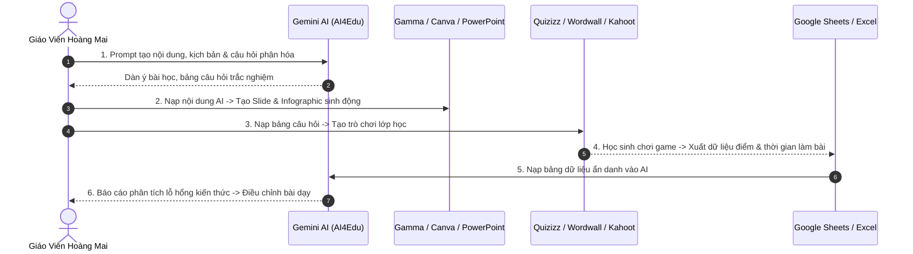

# 🛠️ Chuyên Đề 4: Quy Trình Phối Hợp Công Cụ Dạy Học Số (Digital Toolchain)

Giáo viên Trường Tiểu học Hoàng Mai không chỉ sử dụng AI như một công cụ độc lập mà xây dựng **Quy trình sư phạm số khép kín (Seamless Digital Workflow)**: từ khâu lên ý tưởng nội dung, thiết kế slide, tổ chức trò chơi tương tác cho đến thu thập và phân tích kết quả.

---

## 🔄 1. Sơ Đồ Quy Trình Dạy Học Số Khép Kín



---

## 🎨 2. Hướng Dẫn Tích Hợp Chi Tiết Từng Công Cụ

### 2.1. AI + Gamma / Tome / Canva: Tạo Slide Tự Động Từ Dàn Ý
* **Cách thực hiện:** Dùng AI để sinh dàn ý thuyết trình theo định dạng cấu trúc gạch đầu dòng ngắn gọn $\rightarrow$ Copy toàn bộ vào ô *Generate Presentation* của **Gamma.app** hoặc **Canva Magic Design**.

**Mẫu Prompt sinh dàn ý Slide cho Gamma:**
```text
Hãy tạo dàn ý bài giảng trình chiếu 6 slide môn Tự nhiên và Xã hội Lớp 2 bài 'Chăm sóc và bảo vệ cơ quan hô hấp':
Mỗi slide gồm:
- Tiêu đề slide (dưới 8 từ)
- 3 ý chính ngắn gọn (mỗi ý dưới 12 từ, dùng hình tượng dễ hiểu)
- Gợi ý từ khóa tìm hình ảnh minh họa (ví dụ: 'lá phổi cười vui vẻ', 'rửa tay bằng xà phòng').
Định dạng dạng Markdown phân cấp để import trực tiếp vào Gamma.app.
```

---

### 2.2. AI + Quizizz / Wordwall / Kahoot: Tạo Trò Chơi Ôn Tập Nhanh
* **Cách thực hiện:** Yêu cầu AI xuất bảng câu hỏi trắc nghiệm gồm 4 cột (`Câu hỏi`, `Lựa chọn 1`, `Lựa chọn 2`, `Lựa chọn 3`, `Đáp án đúng`, `Thời gian tính bằng giây`).
* Copy bảng này vào file Excel mẫu của **Quizizz** hoặc **Wordwall** để tải lên trong 1 giây mà không cần gõ từng câu.

**Mẫu Prompt xuất dữ liệu chuẩn Quizizz Excel:**
```text
Hãy tạo 5 câu hỏi trắc nghiệm đố vui môn Khoa học Lớp 4 bài 'Không khí có những tính chất gì?'.
Xuất kết quả dưới dạng BẢNG CÓ CỘT:
| Question Text | Option 1 | Option 2 | Option 3 | Option 4 | Correct Answer (1-4) | Time in seconds |
Thời gian mỗi câu là 30 giây. Các phương án sai phải có tính đánh lừa sư phạm nhẹ nhàng.
```

---

### 2.3. AI + Excel / Google Sheets: Đọc Hiểu & Báo Cáo Nhanh
* Giáo viên tải file CSV kết quả từ Quizizz / Form khảo sát $\rightarrow$ Dán vào AI $\rightarrow$ Yêu cầu AI vẽ biểu đồ phân phối điểm và liệt kê top 3 câu hỏi có tỉ lệ trả lời sai cao nhất.
