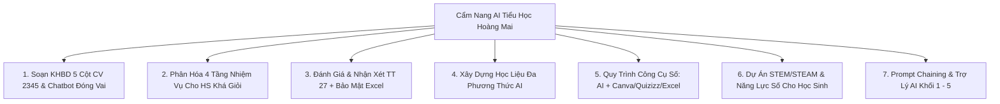

# 🏫 Phương Án Ứng Dụng AI Cấp Tiểu Học - Trường Tiểu Học Hoàng Mai

Chào mừng các thầy cô giáo **Trường Tiểu học Hoàng Mai** đến với Cẩm nang Hướng dẫn & Hệ sinh thái Ứng dụng Trí tuệ Nhân tạo (AI) thế hệ mới trong công tác giảng dạy, kiểm tra đánh giá và quản lý học sinh theo chuẩn **Chương trình Giáo dục Phổ thông 2018 (CTGDPT 2018)**.

---

## 💻 1. Trải Nghiệm Ứng Dụng Web App Trực Quan (Streamlit)

Giáo viên Trường Hoàng Mai có thể sử dụng ngay giao diện Web đồ họa trực quan không cần gõ lệnh:

```powershell
# Chạy Web App trên máy tính giáo viên
streamlit run app.py
```

### 🌟 5 Tính Năng Nổi Bật Trên Web App:
1. 📑 **Soạn KHBD 5 Cột (CV 2345):** Tự động sinh bảng 5 cột chuẩn và có nút **Tải file Word (.docx)** được định dạng sẵn bảng biểu, màu sắc sư phạm.
2. 🎯 **Phân Hóa Nhiệm Vụ 4 Cấp Độ:** Sinh ngay 4 tầng bài tập (*Học sinh cần hỗ trợ $\rightarrow$ Đạt chuẩn $\rightarrow$ Khá $\rightarrow$ Giỏi/Nâng cao*) + Thử thách STEM mini.
3. 📊 **Trợ Lý Đánh Giá Học Sinh (Thông tư 27):** Nhập nhanh ghi chú thực tế $\rightarrow$ AI sinh bảng đánh giá 3 mặt (*Môn học, Năng lực, Phẩm chất*) và đoạn văn nhận xét gửi phụ huynh để copy 1-click.
4. 💬 **AI Socratic Tutor 24/7:** Khung chat tương tác gợi mở với các nhân vật thân thiện (*Bác Cú Thông Thái, Thỏ Trắng, Cô Giáo AI, Nhà Khoa Học Nhí*).
5. 🎮 **Tạo Bộ Câu Hỏi Game Quizizz / Wordwall:** Sinh câu hỏi đố vui và **Tải file Excel mẫu chuẩn (.xlsx)** để import thẳng vào Quizizz.

---

## 🌟 2. Tầm Nhìn & Định Hướng Trường Chất Lượng Cao Hoàng Mai

Trường Tiểu học Hoàng Mai xác định việc ứng dụng Trí tuệ Nhân tạo không chỉ dừng lại ở mức "biết sử dụng chatbot" mà hướng tới **Quy trình Sư phạm Số Toàn diện (End-to-End Digital Workflow)**, nhằm:
1. **Giảm tải áp lực công việc hành chính & soạn bài thủ công** để giáo viên dành nhiều thời gian hơn cho việc tương tác, đồng hành cùng học sinh.
2. **Dạy học phân hóa sâu sắc (Differentiated Instruction):** Khai phá tối đa tiềm năng của học sinh khá giỏi trường chất lượng cao, đồng thời xây dựng giàn giáo học tập vững chắc (Scaffolding) cho học sinh cần hỗ trợ.
3. **Phát triển năng lực tư duy bậc cao:** Đưa các hoạt động tranh biện, giải quyết vấn đề thực tiễn và dự án STEM/STEAM vào từng tiết học.
4. **Giáo dục Năng lực số & Đạo đức AI (AI Literacy):** Giúp học sinh tiểu học Hoàng Mai trở thành những công dân số tự tin, biết sử dụng AI an toàn và có trách nhiệm.

---

## 🧭 3. Khung 7 Trụ Cột Năng Lực AI Dành Cho Giáo Viên Hoàng Mai



### Bảng Tra Cứu Các Chuyên Đề Hướng Dẫn:

| STT | Chuyên đề Trọng tâm | Mục tiêu Thực tiễn | Tài liệu Chi tiết |
| :---: | :--- | :--- | :--- |
| **1** | **Soạn KHBD 5 Cột (Công văn 2345)** | Thiết kế Kế hoạch bài dạy chuẩn 5 cột, 4 bước tổ chức hoạt động, chatbot đóng vai nhân vật | [Xem Chuyên đề 1 →](/hoang-mai-primary/lesson-planning-2345) |
| **2** | **Phân Hóa Nhiệm Vụ 4 Cấp Độ** | Tạo 4 tầng nhiệm vụ (Hỗ trợ - Chuẩn - Khá - Giỏi), bài toán nhiều cách giải cho trường CLC | [Xem Chuyên đề 2 →](/hoang-mai-primary/differentiation-advanced) |
| **3** | **Đánh Giá & Nhận Xét (Thông tư 27)** | Viết nhận xét định tính (Môn học, Năng lực, Phẩm chất), phân tích file Excel ẩn danh | [Xem Chuyên đề 3 →](/hoang-mai-primary/assessment-tt27) |
| **4** | **Quy Trình Công Cụ Số (Digital Toolchain)** | Chuỗi liên hoàn: AI $\rightarrow$ Gamma/Canva $\rightarrow$ Quizizz/Wordwall $\rightarrow$ Excel $\rightarrow$ AI | [Xem Chuyên đề 4 →](/hoang-mai-primary/digital-toolchain) |
| **5** | **STEM/STEAM & Năng Lực Số Tiểu Học** | Thiết kế dự án STEM theo khối lớp, giáo dục kỹ năng kiểm chứng tin giả và an toàn số | [Xem Chuyên đề 5 →](/hoang-mai-primary/stem-ai-literacy) |
| **6** | **Kỹ Năng Prompting & Trợ Lý Khối 1 - 5** | Cấu trúc prompt chuẩn, Prompt Chaining, tạo Trợ lý AI riêng cho từng Tổ chuyên môn | [Xem Chuyên đề 6 →](/hoang-mai-primary/prompt-engineering) |

---

## ⚡ 4. Bộ Lệnh Dòng Lệnh (CLI) Dành Riêng Cho Trường Hoàng Mai

Bộ công cụ `ai4edu.cli` cũng được tích hợp sẵn các lệnh dòng lệnh:

```powershell
# 1. Soạn Kế hoạch bài dạy 5 cột chuẩn CV 2345 (có nhiệm vụ mở rộng cho HS khá giỏi)
python -m ai4edu.cli plan-2345 --grade 4 --subject math --topic "Phân số và phép cộng phân số"

# 2. Sinh 4 tầng nhiệm vụ phân hóa năng lực từ một đơn vị bài học
python -m ai4edu.cli differentiate --grade 5 --subject science --topic "Sự biến đổi hóa học của chất"

# 3. Hỗ trợ viết nhận xét học sinh định kỳ chuẩn Thông tư 27/2020
python -m ai4edu.cli review-tt27 --grade 3 --subject vietnamese --alias "HS05" --notes "Đọc to, diễn cảm, biết dùng từ gợi tả, nhưng còn lúng túng khi viết đoạn văn tả đồ vật"
```
