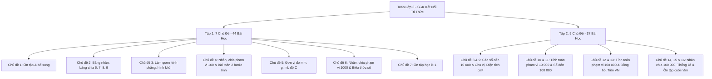

# 📐 Danh Mục Chương Trình & Chi Tiết Các Bài Học Môn Toán Lớp 3 & Lớp 5 (CTGDPT 2018)

> **Căn cứ nguồn học liệu:** Sách giáo khoa **Toán 3 & Toán 5 - Bộ sách KẾT NỐI TRI THỨC VỚI CUỘC SỐNG** (Nhà xuất bản Giáo dục Việt Nam).  
> Phục vụ công tác xây dựng Kế hoạch bài dạy 5 cột (Công văn 2345), Phân hóa nhiệm vụ 4 tầng và Đánh giá học sinh (Thông tư 27) tại **Trường Tiểu học Hoàng Mai**.

---

## 📘 1. MÔN TOÁN LỚP 3 (16 CHỦ ĐỀ • 81 BÀI HỌC)

### 📗 Toán 3 - Tập 1 (Học Kì I • Bài 1 $\rightarrow$ Bài 44)

| Bài | Tên bài học chuẩn SGK | Chủ đề | Trang SGK | Trọng tâm sư phạm & Thử thách khá giỏi |
| :---: | :--- | :--- | :---: | :--- |
| **1** | Ôn tập các số đến 1 000 | Chủ đề 1: Ôn tập và bổ sung | Tr. 6 | Đọc, viết, phân tích cấu tạo số có 3 chữ số; so sánh và xếp thứ tự |
| **2** | Ôn tập phép cộng, phép trừ trong phạm vi 1 000 | Chủ đề 1: Ôn tập và bổ sung | Tr. 9 | Đặt tính rồi tính, cộng trừ có nhớ 1 lần; tính nhẩm |
| **3** | Tìm thành phần trong phép cộng, phép trừ | Chủ đề 1: Ôn tập và bổ sung | Tr. 11 | Tìm số hạng chưa biết, tìm số bị trừ, tìm số trừ |
| **4** | Ôn tập bảng nhân 2; 5, bảng chia 2; 5 | Chủ đề 1: Ôn tập và bổ sung | Tr. 14 | Thuộc bảng nhân chia 2, 5; giải toán thực tế 1 bước tính |
| **5** | Bảng nhân 3, bảng chia 3 | Chủ đề 1: Ôn tập và bổ sung | Tr. 16 | Thành lập bảng nhân chia 3; nhận biết quy luật dãy số cách đều 3 |
| **6** | Bảng nhân 4, bảng chia 4 | Chủ đề 1: Ôn tập và bổ sung | Tr. 19 | Thành lập bảng nhân chia 4; ứng dụng tính số bánh xe, số chân bàn |
| **7** | Ôn tập hình học và đo lường | Chủ đề 1: Ôn tập và bổ sung | Tr. 21 | Nhận diện khối trụ, cầu, hộp chữ nhật; 3 điểm thẳng hàng; đường gấp khúc |
| **8** | Luyện tập chung | Chủ đề 1: Ôn tập và bổ sung | Tr. 24 | Củng cố tổng hợp số học, hình học và giải toán có lời văn |
| **9** | Bảng nhân 6, bảng chia 6 | Chủ đề 2: Bảng nhân, bảng chia | Tr. 28 | Thành lập bảng nhân chia 6; giải bài toán chia đều và gấp lên 6 lần |
| **10** | Bảng nhân 7, bảng chia 7 | Chủ đề 2: Bảng nhân, bảng chia | Tr. 31 | Thành lập bảng nhân chia 7; ứng dụng tính số ngày trong các tuần lễ |
| **11** | Bảng nhân 8, bảng chia 8 | Chủ đề 2: Bảng nhân, bảng chia | Tr. 33 | Thành lập bảng nhân chia 8; quan hệ giữa bảng nhân 4 và bảng nhân 8 |
| **12** | Bảng nhân 9, bảng chia 9 | Chủ đề 2: Bảng nhân, bảng chia | Tr. 36 | Bảng nhân chia 9; mẹo ngón tay và quy luật tổng các chữ số bằng 9 |
| **13** | Tìm thành phần trong phép nhân, phép chia | Chủ đề 2: Bảng nhân, bảng chia | Tr. 39 | Muốn tìm thừa số ta lấy tích chia thừa số kia; tìm SBC và số chia |
| **14** | Một phần mấy | Chủ đề 2: Bảng nhân, bảng chia | Tr. 42 | Khái niệm $\frac{1}{2}, \frac{1}{3}, \frac{1}{4}, \frac{1}{5}...$; trực quan hóa qua gấp giấy và tô màu |
| **15** | Luyện tập chung | Chủ đề 2: Bảng nhân, bảng chia | Tr. 46 | Trò chơi đố vui toán học, tính nhẩm nhanh và giải toán liên hoàn |
| **16** | Điểm ở giữa, trung điểm của đoạn thẳng | Chủ đề 3: Làm quen hình phẳng, hình khối | Tr. 49 | Khái niệm điểm ở giữa; trung điểm chia đoạn thẳng thành 2 phần bằng nhau |
| **17** | Hình tròn. Tâm, bán kính, đường kính của hình tròn | Chủ đề 3: Làm quen hình phẳng, hình khối | Tr. 52 | Nhận biết tâm O, bán kính OM, đường kính AB; đường kính dài gấp 2 lần bán kính |
| **18** | Góc, góc vuông, góc không vuông | Chủ đề 3: Làm quen hình phẳng, hình khối | Tr. 54 | Dùng thước ê-ke để kiểm tra và vẽ góc vuông đỉnh O, cạnh OA, OB |
| **19** | Hình tam giác, hình tứ giác. Hình chữ nhật, hình vuông | Chủ đề 3: Làm quen hình phẳng, hình khối | Tr. 56 | Đếm đỉnh, cạnh; hình chữ nhật có 4 góc vuông, 2 dài bằng nhau, 2 ngắn bằng nhau |
| **20** | Thực hành vẽ góc vuông, vẽ đường tròn, hình vuông, hình chữ nhật và vẽ trang trí | Chủ đề 3: Làm quen hình phẳng, hình khối | Tr. 61 | Kỹ năng sử dụng thước kẻ, ê-ke, compa vẽ hình mỹ thuật và trang trí |
| **21** | Khối lập phương, khối hộp chữ nhật | Chủ đề 3: Làm quen hình phẳng, hình khối | Tr. 63 | Nhận biết 8 đỉnh, 12 cạnh, 6 mặt hình chữ nhật (HHCN) / 6 mặt hình vuông (HLP) |
| **22** | Luyện tập chung | Chủ đề 3: Làm quen hình phẳng, hình khối | Tr. 65 | Bài toán đếm khối lập phương nhỏ, tư duy hình học không gian |
| **23** | Nhân số có hai chữ số với số có một chữ số | Chủ đề 4: Phép tính phạm vi 100 | Tr. 67 | Nhân không nhớ và nhân có nhớ 1 lần từ hàng đơn vị sang hàng chục |
| **24** | Gấp một số lên một số lần | Chủ đề 4: Phép tính phạm vi 100 | Tr. 70 | Quy tắc: Muốn gấp một số lên nhiều lần, ta lấy số đó nhân với số lần |
| **25** | Phép chia hết, phép chia có dư | Chủ đề 4: Phép tính phạm vi 100 | Tr. 72 | Bản chất phép chia có dư; quy tắc bất biến: **Số dư luôn bé hơn số chia** |
| **26** | Chia số có hai chữ số cho số có một chữ số | Chủ đề 4: Phép tính phạm vi 100 | Tr. 75 | Kỹ thuật chia từ trái sang phải, chia hết và chia có dư |
| **27** | Giảm một số đi một số lần | Chủ đề 4: Phép tính phạm vi 100 | Tr. 79 | Quy tắc: Muốn giảm một số đi nhiều lần, ta lấy số đó chia cho số lần |
| **28** | Bài toán giải bằng hai bước tính | Chủ đề 4: Phép tính phạm vi 100 | Tr. 81 | Dạng toán nhiều hơn/ít hơn và tìm tổng cả hai phần; lập sơ đồ tóm tắt |
| **29** | Luyện tập chung | Chủ đề 4: Phép tính phạm vi 100 | Tr. 83 | Củng cố toán 2 bước tính kết hợp gấp/giảm số lần |
| **30** | Mi-li-mét | Chủ đề 5: Đơn vị đo lường | Tr. 85 | Đơn vị đo độ dài mm: $1\text{ cm} = 10\text{ mm}$, $1\text{ m} = 1000\text{ mm}$ |
| **31** | Gam | Chủ đề 5: Đơn vị đo lường | Tr. 87 | Đơn vị đo khối lượng g: $1\text{ kg} = 1000\text{ g}$; đọc số cân đĩa và cân đồng hồ |
| **32** | Mi-li-lít | Chủ đề 5: Đơn vị đo lường | Tr. 89 | Đơn vị đo dung tích ml: $1\text{ l} = 1000\text{ ml}$; đọc vạch chia ca đong |
| **33** | Nhiệt độ. Đơn vị đo nhiệt độ | Chủ đề 5: Đơn vị đo lường | Tr. 91 | Đơn vị độ C ($^\circ\text{C}$); đọc nhiệt kế phòng và nhiệt kế thủy ngân/điện tử đo thân nhiệt |
| **34** | Thực hành và trải nghiệm với các đơn vị mi-li-mét, gam, mi-li-lít, độ C | Chủ đề 5: Đơn vị đo lường | Tr. 93 | Trải nghiệm cân đo đồ dùng học tập, đo lượng nước uống, theo dõi thời tiết |
| **35** | Luyện tập chung | Chủ đề 5: Đơn vị đo lường | Tr. 95 | Tính toán cộng trừ có kèm đơn vị đo và giải toán đo lường thực tế |
| **36** | Nhân số có ba chữ số với số có một chữ số | Chủ đề 6: Phép tính phạm vi 1 000 | Tr. 97 | Đặt tính và tính nhân có nhớ 1 lần (sang hàng chục hoặc hàng trăm) |
| **37** | Chia số có ba chữ số cho số có một chữ số | Chủ đề 6: Phép tính phạm vi 1 000 | Tr. 99 | Kỹ thuật chia 3 lượt; xử lý phép chia có chữ số 0 ở thương |
| **38** | Biểu thức số. Tính giá trị của biểu thức số | Chủ đề 6: Phép tính phạm vi 1 000 | Tr. 104 | Thứ tự thực hiện: Nhân chia trước, cộng trừ sau; thực hiện trong ngoặc trước |
| **39** | So sánh số lớn gấp mấy lần số bé | Chủ đề 6: Phép tính phạm vi 1 000 | Tr. 109 | Quy tắc: Muốn tìm số lớn gấp mấy lần số bé, ta lấy số lớn chia cho số bé |
| **40** | Luyện tập chung | Chủ đề 6: Phép tính phạm vi 1 000 | Tr. 111 | Tính nhanh giá trị biểu thức và giải toán có lời văn tổng hợp |
| **41** | Ôn tập phép nhân, phép chia trong phạm vi 100, 1 000 | Chủ đề 7: Ôn tập học kì 1 | Tr. 113 | Ôn tập tính nhẩm, đặt tính và giải toán thực tế chuyến đi Lăng Bác |
| **42** | Ôn tập biểu thức số | Chủ đề 7: Ôn tập học kì 1 | Tr. 116 | Thứ tự tính toán biểu thức không ngoặc và có ngoặc |
| **43** | Ôn tập hình học và đo lường | Chủ đề 7: Ôn tập học kì 1 | Tr. 118 | Hệ thống hóa góc vuông, bán kính, đường kính, khối lập phương, đo lường |
| **44** | Ôn tập chung | Chủ đề 7: Ôn tập học kì 1 | Tr. 120 | Đánh giá năng lực cuối học kì I |

---

### 📙 Toán 3 - Tập 2 (Học Kì II • Bài 45 $\rightarrow$ Bài 81)

| Bài | Tên bài học chuẩn SGK | Chủ đề | Trọng tâm sư phạm & Thử thách khá giỏi |
| :---: | :--- | :--- | :--- |
| **45** | Các số có bốn chữ số. Số 10 000 | Chủ đề 8: Các số đến 10 000 | Đọc, viết số có 4 chữ số; cấu tạo nghìn, trăm, chục, đơn vị |
| **46** | So sánh các số trong phạm vi 10 000 | Chủ đề 8: Các số đến 10 000 | So sánh từng hàng từ trái sang phải; xếp thứ tự dãy số |
| **47** | Làm quen với chữ số La Mã | Chủ đề 8: Các số đến 10 000 | Đọc viết I, V, X, XI, XII... trên mặt đồng hồ và thế kỉ |
| **48** | Làm tròn số đến hàng chục, hàng trăm | Chủ đề 8: Các số đến 10 000 | Quy tắc làm tròn số phục vụ ước lượng trong đời sống |
| **49** | Luyện tập chung | Chủ đề 8: Các số đến 10 000 | Củng cố kiến thức về số đến 10 000 |
| **50** | Chu vi hình tam giác, hình tứ giác, hình chữ nhật, hình vuông | Chủ đề 9: Chu vi, diện tích một số hình phẳng | Công thức tính chu vi các hình: $P_{\text{hcn}} = (a+b) \times 2$; $P_{\text{hv}} = a \times 4$ |
| **51** | Diện tích của một hình. Xăng-ti-mét vuông | Chủ đề 9: Chu vi, diện tích một số hình phẳng | Biểu tượng diện tích lưới ô vuông và đơn vị $\text{cm}^2$ |
| **52** | Diện tích hình chữ nhật, diện tích hình vuông | Chủ đề 9: Chu vi, diện tích một số hình phẳng | Công thức $S_{\text{hcn}} = a \times b$; $S_{\text{hv}} = a \times a$ |
| **53** | Luyện tập chung | Chủ đề 9: Chu vi, diện tích một số hình phẳng | Phân biệt chu vi và diện tích; bài toán thực tế lát gạch |
| **54** | Phép cộng trong phạm vi 10 000 | Chủ đề 10: Cộng, trừ, nhân, chia phạm vi 10 000 | Cộng có nhớ không liên tiếp và liên tiếp |
| **55** | Phép trừ trong phạm vi 10 000 | Chủ đề 10: Cộng, trừ, nhân, chia phạm vi 10 000 | Trừ có nhớ; giải bài toán tìm phần còn lại |
| **56** | Nhân số có bốn chữ số với số có một chữ số | Chủ đề 10: Cộng, trừ, nhân, chia phạm vi 10 000 | Đặt tính nhân số lớn; nhân nhẩm hàng nghìn |
| **57** | Chia số có bốn chữ số cho số có một chữ số | Chủ đề 10: Cộng, trừ, nhân, chia phạm vi 10 000 | Chia hết và chia có dư; chia có chữ số 0 ở thương |
| **58** | Luyện tập chung | Chủ đề 10: Cộng, trừ, nhân, chia phạm vi 10 000 | Tính giá trị biểu thức và giải toán tổng hợp |
| **59** | Các số có năm chữ số. Số 100 000 | Chủ đề 11: Các số đến 100 000 | Cấu tạo số hàng chục nghìn, nghìn, trăm, chục, đơn vị |
| **60** | So sánh các số trong phạm vi 100 000 | Chủ đề 11: Các số đến 100 000 | So sánh số lượng chữ số và giá trị theo hàng |
| **61** | Làm tròn số đến hàng nghìn, hàng chục nghìn | Chủ đề 11: Các số đến 100 000 | Ứng dụng làm tròn số dân số, khoảng cách địa lý |
| **62** | Luyện tập chung | Chủ đề 11: Các số đến 100 000 | Củng cố số có 5 chữ số |
| **63** | Phép cộng trong phạm vi 100 000 | Chủ đề 12: Cộng, trừ phạm vi 100 000 | Cộng nhiều chữ số có nhớ |
| **64** | Phép trừ trong phạm vi 100 000 | Chủ đề 12: Cộng, trừ phạm vi 100 000 | Trừ nhiều chữ số có mượn |
| **65** | Luyện tập chung | Chủ đề 12: Cộng, trừ phạm vi 100 000 | Giải bài toán về thu chi, ngân sách |
| **66** | Xem đồng hồ. Tháng - năm | Chủ đề 13: Đồng hồ, Tháng - năm, Tiền VN | Đọc giờ chính xác đến từng phút; số ngày trong từng tháng |
| **67** | Thực hành xem đồng hồ, xem lịch | Chủ đề 13: Đồng hồ, Tháng - năm, Tiền VN | Lập thời gian biểu học tập và sinh hoạt cá nhân |
| **68** | Tiền Việt Nam | Chủ đề 13: Đồng hồ, Tháng - năm, Tiền VN | Nhận biết tờ tiền 10 000đ, 20 000đ, 50 000đ, 100 000đ; tính tiền thối |
| **69** | Luyện tập chung | Chủ đề 13: Đồng hồ, Tháng - năm, Tiền VN | Bài toán mua sắm và quản lý tài chính nhí |
| **70** | Nhân số có năm chữ số với số có một chữ số | Chủ đề 14: Nhân, chia phạm vi 100 000 | Nhân số lớn; tính diện tích đất đai |
| **71** | Chia số có năm chữ số cho số có một chữ số | Chủ đề 14: Nhân, chia phạm vi 100 000 | Chia số lớn; bài toán rút về đơn vị |
| **72** | Luyện tập chung | Chủ đề 14: Nhân, chia phạm vi 100 000 | Củng cố 4 phép tính số học |
| **73** | Thu thập, phân loại, ghi chép số liệu. Bảng số liệu | Chủ đề 15: Thống kê & Xác suất | Kỹ năng điều tra số liệu, lập bảng thống kê lớp học |
| **74** | Khả năng xảy ra của một sự kiện | Chủ đề 15: Thống kê & Xác suất | Nhận biết sự kiện *Chắc chắn*, *Có thể*, *Không thể* |
| **75** | Thực hành và trải nghiệm thu thập số liệu | Chủ đề 15: Thống kê & Xác suất | Dự án thống kê sở thích, chiều cao của học sinh |
| **76** | Ôn tập các số trong phạm vi 10 000, 100 000 | Chủ đề 16: Ôn tập cuối năm | Hệ thống hóa mạch kiến thức số học |
| **77** | Ôn tập phép cộng, phép trừ phạm vi 100 000 | Chủ đề 16: Ôn tập cuối năm | Rèn kỹ năng tính toán chuẩn xác |
| **78** | Ôn tập phép nhân, phép chia phạm vi 100 000 | Chủ đề 16: Ôn tập cuối năm | Giải toán có lời văn bằng 2-3 bước tính |
| **79** | Ôn tập hình học, đo lường | Chủ đề 16: Ôn tập cuối năm | Chu vi, diện tích, khối hộp chữ nhật, lập phương |
| **80** | Ôn tập bảng số liệu, khả năng sự kiện | Chủ đề 16: Ôn tập cuối năm | Đọc biểu đồ bảng số liệu và xác suất cơ bản |
| **81** | Ôn tập chung | Chủ đề 16: Ôn tập cuối năm | Đánh giá tổng kết năng lực môn Toán Lớp 3 |

---

## 📕 2. MÔN TOÁN LỚP 5 (12 CHỦ ĐỀ • 66 BÀI HỌC)

### 📗 Toán 5 - Tập 1 (Học Kì I • Bài 1 $\rightarrow$ Bài 35)
* **Chủ đề 1: Ôn tập và bổ sung** (Bài 1 $\rightarrow$ Bài 9): Số tự nhiên, Phân số, Phân số thập phân, Hỗn số, Hình học và đo lường.
* **Chủ đề 2: Số thập phân** (Bài 10 $\rightarrow$ Bài 15): Khái niệm, So sánh, Làm tròn, Viết số đo đại lượng dưới dạng số thập phân, Đơn vị Héc-ta ($\text{ha}$).
* **Chủ đề 3: Các phép tính với số thập phân** (Bài 16 $\rightarrow$ Bài 24): Cộng, Trừ, Nhân (với số tự nhiên & số thập phân), Chia (cho số tự nhiên, tự nhiên chia thập phân, thập phân chia thập phân).
* **Chủ đề 4: Hình phẳng** (Bài 25 $\rightarrow$ Bài 29): Diện tích hình tam giác, Diện tích hình thang, Chu vi và diện tích hình tròn, Cắt ghép hình phẳng.
* **Chủ đề 5: Ôn tập học kì 1** (Bài 30 $\rightarrow$ Bài 35): Ôn tập số thập phân, phép tính, hình học, giải toán có lời văn và ôn tập tổng kết HK1.

### 📙 Toán 5 - Tập 2 (Học Kì II • Bài 36 $\rightarrow$ Bài 66)
* **Chủ đề 6: Tỉ số và các bài toán liên quan** (Bài 36 $\rightarrow$ Bài 41): Tìm 2 số khi biết tổng/hiệu và tỉ số, Tỉ số phần trăm, Tìm giá trị phần trăm, Tỉ lệ bản đồ.
* **Chủ đề 7: Thể tích & Hình khối** (Bài 42 $\rightarrow$ Bài 49): Đơn vị $\text{cm}^3, \text{dm}^3, \text{m}^3$, Diện tích xung quanh & toàn phần HHCN/HLP, Thể tích HHCN/HLP, Hình trụ và hình cầu.
* **Chủ đề 8: Số đo thời gian & Toán chuyển động đều** (Bài 50 $\rightarrow$ Bài 56): Cộng trừ nhân chia thời gian, Vận tốc ($v$), Quãng đường ($s$), Thời gian ($t$), Toán chuyển động ngược chiều và cùng chiều.
* **Chủ đề 9: Một số yếu tố thống kê và xác suất** (Bài 57 $\rightarrow$ Bài 59): Biểu đồ hình quạt tròn (\%), Mô tả xác suất sự kiện.
* **Chủ đề 10: Ôn tập cuối năm** (Bài 60 $\rightarrow$ Bài 66): Ôn tập toàn diện số học, hình học, đo lường, chuyển động đều, thống kê và tổng kết toàn cấp Tiểu học (K-5).
