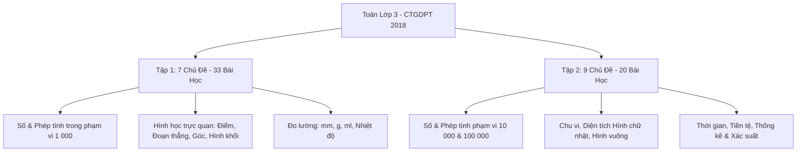
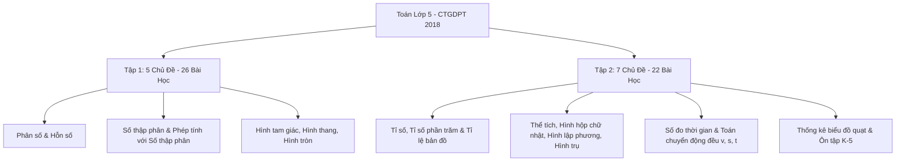

# 📐 Danh Mục Chương Trình & Bài Học Môn Toán Lớp 3 & Lớp 5 (CTGDPT 2018)

Tài liệu tham khảo chính thức phục vụ công tác soạn Kế hoạch bài dạy (Công văn 2345), Thiết kế nhiệm vụ phân hóa 4 tầng và Đánh giá học sinh (Thông tư 27) tại **Trường Tiểu học Hoàng Mai**.

---

## 📘 1. Môn Toán Lớp 3 (Tập 1 & Tập 2 - 16 Chủ Đề, 53 Bài Học)

### 📗 Toán 3 - Tập 1 (Học Kì I)

| Bài | Tên bài học | Chủ đề | Trọng tâm sư phạm & Thử thách khá giỏi |
| :---: | :--- | :--- | :--- |
| **1** | Ôn tập các số đến 1 000 | Chủ đề 1: Ôn tập & bổ sung | Đọc, viết, cấu tạo số thập phân vị |
| **2** | Ôn tập phép cộng, phép trừ trong phạm vi 1 000 | Chủ đề 1: Ôn tập & bổ sung | Tính nhẩm nhanh, tìm thành phần chưa biết |
| **3** | Tìm thành phần trong phép cộng, phép trừ | Chủ đề 1: Ôn tập & bổ sung | Quan hệ đảo ngược của phép tính |
| **4** | Ôn tập bảng nhân 2; 5, bảng chia 2; 5 | Chủ đề 1: Ôn tập & bổ sung | Vận dụng giải toán thực tế |
| **5** | Bảng nhân 3, bảng chia 3 | Chủ đề 1: Ôn tập & bổ sung | Quy luật dãy số cách đều |
| **6** | Bảng nhân 4, bảng chia 4 | Chủ đề 1: Ôn tập & bổ sung | Mối quan hệ giữa bảng 2 và bảng 4 |
| **7** | Ôn tập hình học và đo lường | Chủ đề 1: Ôn tập & bổ sung | Nhận diện hình phẳng và ước lượng |
| **8** | Luyện tập chung | Chủ đề 1: Ôn tập & bổ sung | Giải toán 2 bước tính liên hoàn |
| **9** | Bảng nhân 6, bảng chia 6 | Chủ đề 2: Bảng nhân, bảng chia | Ứng dụng trò chơi đố vui Quizizz |
| **10** | Bảng nhân 7, bảng chia 7 | Chủ đề 2: Bảng nhân, bảng chia | Vận dụng bảng tính lịch tuần |
| **11** | Bảng nhân 8, bảng chia 8 | Chủ đề 2: Bảng nhân, bảng chia | Xây dựng sơ đồ tư duy nhân chia |
| **12** | Bảng nhân 9, bảng chia 9 | Chủ đề 2: Bảng nhân, bảng chia | Mẹo ngón tay nhân 9 & tư duy thuật toán |
| **13** | Tìm thành phần trong phép nhân, phép chia | Chủ đề 2: Bảng nhân, bảng chia | Tìm thừa số, số bị chia, số chia |
| **14** | Một phần mấy (1/2, 1/3, 1/4, 1/5...) | Chủ đề 2: Bảng nhân, bảng chia | Trực quan hóa phân số bằng hình vẽ |
| **15** | Luyện tập chung | Chủ đề 2: Bảng nhân, bảng chia | Toán đố vui logic |
| **16** | Điểm ở giữa, trung điểm của đoạn thẳng | Chủ đề 3: Hình phẳng & hình khối | Thao tác gấp giấy, đo đạc thực hành |
| **17** | Hình tròn. Tâm, bán kính, đường kính | Chủ đề 3: Hình phẳng & hình khối | Vẽ hình tròn bằng compa, nhận biết $d = 2r$ |
| **18** | Góc, góc vuông, góc không vuông | Chủ đề 3: Hình phẳng & hình khối | Dùng ê-ke kiểm tra góc trong thực tế |
| **19** | Hình tam giác, tứ giác, chữ nhật, vuông | Chủ đề 3: Hình phẳng & hình khối | Phân biệt đặc tính các cạnh và góc |
| **20** | Khối lập phương, khối hộp chữ nhật | Chủ đề 3: Hình phẳng & hình khối | Đếm số đỉnh, số cạnh, số mặt |
| **21** | Gấp một số lên một số lần | Chủ đề 4: Phép tính phạm vi 100 | Phân biệt gấp nhiều lần với thêm nhiều đơn vị |
| **22** | Giảm một số đi một số lần | Chủ đề 4: Phép tính phạm vi 100 | Phân biệt giảm nhiều lần với bớt nhiều đơn vị |
| **23** | Nhân số có hai chữ số với số có một chữ số | Chủ đề 4: Phép tính phạm vi 100 | Nhân không nhớ và nhân có nhớ 1 lần |
| **24** | Chia số có hai chữ số cho số có một chữ số | Chủ đề 4: Phép tính phạm vi 100 | Kỹ thuật đặt tính và chia từng hàng |
| **25** | Phép chia hết và phép chia có dư | Chủ đề 4: Phép tính phạm vi 100 | Điều kiện: Số dư luôn nhỏ hơn số chia |
| **26** | Mi-li-mét (mm) | Chủ đề 5: Đơn vị đo lường | Đổi đơn vị đo: $1\text{ cm} = 10\text{ mm}$ |
| **27** | Gam (g) | Chủ đề 5: Đơn vị đo lường | Cân đo đồ vật, $1\text{ kg} = 1000\text{ g}$ |
| **28** | Mi-li-lít (ml) | Chủ đề 5: Đơn vị đo lường | Đọc vạch chia ca đong, $1\text{ l} = 1000\text{ ml}$ |
| **29** | Nhiệt độ. Đo nhiệt độ bằng nhiệt kế | Chủ đề 5: Đơn vị đo lường | Kỹ năng đọc nhiệt kế phòng và thân nhiệt |
| **30** | Nhân số có ba chữ số với số có một chữ số | Chủ đề 6: Phép tính phạm vi 1 000 | Tính nhẩm hàng trăm và nhân có nhớ |
| **31** | Chia số có ba chữ số cho số có một chữ số | Chủ đề 6: Phép tính phạm vi 1 000 | Phép chia có chữ số 0 ở thương |
| **32** | Biểu thức số và tính giá trị biểu thức | Chủ đề 7: Ôn tập học kì I | Thứ tự ưu tiên ngoặc và nhân chia trước |
| **33** | Ôn tập học kì I tổng hợp | Chủ đề 7: Ôn tập học kì I | Đề kiểm tra ma trận 4 mức độ TT 27 |

### 📙 Toán 3 - Tập 2 (Học Kì II)

| Bài | Tên bài học | Chủ đề | Trọng tâm sư phạm & Thử thách khá giỏi |
| :---: | :--- | :--- | :--- |
| **34** | Các số có bốn chữ số. Số 10 000 | Chủ đề 8: Các số có bốn chữ số | Đọc, viết số và viết thành tổng các hàng |
| **35** | So sánh các số có bốn chữ số | Chủ đề 8: Các số có bốn chữ số | Sắp xếp thứ tự từ bé đến lớn / lớn đến bé |
| **36** | Làm quen với chữ số La Mã | Chủ đề 8: Các số có bốn chữ số | Đọc số I, V, X, XI, XII... trên mặt đồng hồ |
| **37** | Làm tròn số đến hàng chục, hàng trăm | Chủ đề 8: Các số có bốn chữ số | Ứng dụng ước lượng nhanh khi mua sắm |
| **38** | Chu vi hình tam giác, hình tứ giác | Chủ đề 9: Chu vi, diện tích | Tổng độ dài các cạnh bao quanh |
| **39** | Chu vi hình chữ nhật, hình vuông | Chủ đề 9: Chu vi, diện tích | $P_{\text{hcn}} = (a+b) \times 2$, $P_{\text{hv}} = a \times 4$ |
| **40** | Diện tích của một hình. Xăng-ti-mét vuông (cm²) | Chủ đề 9: Chu vi, diện tích | Khái niệm lưới ô vuông $1\text{ cm}^2$ |
| **41** | Diện tích hình chữ nhật, diện tích hình vuông | Chủ đề 9: Chu vi, diện tích | $S_{\text{hcn}} = a \times b$, $S_{\text{hv}} = a \times a$ |
| **42** | Phép cộng trong phạm vi 10 000 | Chủ đề 10: Tính phạm vi 10 000 | Cộng có nhớ không liên tiếp và liên tiếp |
| **43** | Phép trừ trong phạm vi 10 000 | Chủ đề 10: Tính phạm vi 10 000 | Kỹ thuật trừ có mượn |
| **44** | Phép nhân số 4 chữ số với số 1 chữ số | Chủ đề 10: Tính phạm vi 10 000 | Đặt tính chuẩn và tính nhanh |
| **45** | Phép chia số 4 chữ số cho số 1 chữ số | Chủ đề 10: Tính phạm vi 10 000 | Chia có dư và bài toán xếp xe/chia quà |
| **46** | Tháng - Năm. Xem lịch và đồng hồ | Chủ đề 11: Thời gian, Tiền tệ | Nhận biết tháng có 30, 31, 28/29 ngày |
| **47** | Tiền Việt Nam | Chủ đề 11: Thời gian, Tiền tệ | Mệnh giá 10k, 20k, 50k, 100k và tính tiền thối |
| **48** | Các số có năm chữ số. Số 100 000 | Chủ đề 12: Số có năm chữ số | Cấu tạo số lớp nghìn và lớp đơn vị |
| **49** | Phép cộng, phép trừ trong phạm vi 100 000 | Chủ đề 12: Số có năm chữ số | Giải bài toán bằng 2-3 bước tính |
| **50** | Phép nhân, phép chia trong phạm vi 100 000 | Chủ đề 12: Số có năm chữ số | Rút về đơn vị và toán tỷ lệ thuận |
| **51** | Bảng số liệu thống kê. Khả năng sự kiện | Chủ đề 13: Thống kê & Xác suất | Đọc bảng số liệu, sự kiện Chắc chắn/Có thể/Không thể |
| **52** | Ôn tập phép tính và giải toán có lời văn | Chủ đề 14: Ôn tập cuối năm | Hệ thống hóa các dạng toán trọng tâm |
| **53** | Ôn tập hình học, đo lường & Ôn tập chung | Chủ đề 14: Ôn tập cuối năm | Đánh giá tổng kết năm học lớp 3 |

---

## 📕 2. Môn Toán Lớp 5 (Tập 1 & Tập 2 - 12 Chủ Đề, 48 Bài Học)

### 📗 Toán 5 - Tập 1 (Học Kì I)

| Bài | Tên bài học | Chủ đề | Trọng tâm sư phạm & Thử thách khá giỏi |
| :---: | :--- | :--- | :--- |
| **1** | Ôn tập số tự nhiên | Chủ đề 1: Ôn tập & bổ sung | Đọc, viết, làm tròn và quy luật số lớn |
| **2** | Ôn tập các phép tính với số tự nhiên | Chủ đề 1: Ôn tập & bổ sung | Tính nhanh, tính bằng cách thuận tiện nhất |
| **3** | Ôn tập phân số và tính chất cơ bản | Chủ đề 1: Ôn tập & bổ sung | Rút gọn, quy đồng và so sánh phân số |
| **4** | Phân số thập phân | Chủ đề 1: Ôn tập & bổ sung | Chuyển đổi mẫu số về $10, 100, 1000$ |
| **5** | Ôn tập các phép tính với phân số | Chủ đề 1: Ôn tập & bổ sung | Tính chất giao hoán, kết hợp, nhân phân phối |
| **6** | Cộng, trừ hai phân số khác mẫu số | Chủ đề 1: Ôn tập & bổ sung | Kỹ thuật tìm Mẫu số chung nhỏ nhất |
| **7** | Hỗn số | Chủ đề 1: Ôn tập & bổ sung | Chuyển đổi giữa Hỗn số và Phân số |
| **8** | Ôn tập hình học và đo lường | Chủ đề 1: Ôn tập & bổ sung | Chu vi, diện tích các hình đã học ở lớp 4 |
| **9** | Luyện tập chung | Chủ đề 1: Ôn tập & bổ sung | Giải toán tổng - tỉ, hiệu - tỉ |
| **10** | Khái niệm số thập phân. Hàng số thập phân | Chủ đề 2: Số thập phân | Phần nguyên, phần thập phân và giá trị theo hàng |
| **11** | So sánh các số thập phân | Chủ đề 2: Số thập phân | So sánh phần nguyên trước, phần thập phân sau |
| **12** | Làm tròn số thập phân | Chủ đề 2: Số thập phân | Quy tắc làm tròn đến hàng đơn vị, phần mười, phần trăm |
| **13** | Viết số đo đại lượng dưới dạng số thập phân | Chủ đề 2: Số thập phân | Chuyển đổi đơn vị đo độ dài, khối lượng, diện tích |
| **14** | Đơn vị đo diện tích: Héc-ta (ha), $\text{km}^2$ | Chủ đề 2: Số thập phân | $1\text{ ha} = 10 000\text{ m}^2$, $1\text{ km}^2 = 100\text{ ha}$ |
| **15** | Phép cộng số thập phân | Chủ đề 3: Phép tính số thập phân | Đặt dấu phẩy thẳng cột, cộng như số tự nhiên |
| **16** | Phép trừ số thập phân | Chủ đề 3: Phép tính số thập phân | Thêm số 0 vào phần thập phân để trừ có mượn |
| **17** | Phép nhân số thập phân với số tự nhiên | Chủ đề 3: Phép tính số thập phân | Đếm chữ số phần thập phân để đặt dấu phẩy ở tích |
| **18** | Phép nhân số thập phân với số thập phân | Chủ đề 3: Phép tính số thập phân | Nhân nhẩm với 0,1; 0,01; 0,001 |
| **19** | Phép chia số thập phân cho số tự nhiên | Chủ đề 3: Phép tính số thập phân | Viết dấu phẩy vào thương trước khi chia phần thập phân |
| **20** | Phép chia một số tự nhiên cho số thập phân | Chủ đề 3: Phép tính số thập phân | Đếm phần thập phân số chia $\rightarrow$ thêm số 0 vào số bị chia |
| **21** | Phép chia số thập phân cho số thập phân | Chủ đề 3: Phép tính số thập phân | Dịch chuyển dấu phẩy ở cả hai số |
| **22** | Hình tam giác. Diện tích hình tam giác | Chủ đề 4: Hình phẳng | $S = \frac{a \times h}{2}$, nhận biết chiều cao tương ứng |
| **23** | Hình thang. Diện tích hình thang | Chủ đề 4: Hình phẳng | $S = \frac{(a+b) \times h}{2}$, bài toán mở rộng đáy |
| **24** | Chu vi và diện tích hình tròn | Chủ đề 4: Hình phẳng | $C = d \times 3{,}14 = r \times 2 \times 3{,}14$; $S = r \times r \times 3{,}14$ |
| **25** | Ôn tập số thập phân và các phép tính | Chủ đề 5: Ôn tập học kì I | Tính giá trị biểu thức chứa số thập phân |
| **26** | Ôn tập hình học, đo lường & Tổng kết HK1 | Chủ đề 5: Ôn tập học kì I | Ma trận đề thi kiểm tra định kỳ học kì I |

### 📙 Toán 5 - Tập 2 (Học Kì II)

| Bài | Tên bài học | Chủ đề | Trọng tâm sư phạm & Thử thách khá giỏi |
| :---: | :--- | :--- | :--- |
| **27** | Tỉ số. Tìm hai số khi biết tổng/hiệu và tỉ số | Chủ đề 6: Tỉ số & Tỉ số phần trăm | Sơ đồ đoạn thẳng và phương pháp đại số cơ bản |
| **28** | Tỉ số phần trăm. Tìm tỉ số phần trăm | Chủ đề 6: Tỉ số & Tỉ số phần trăm | $\frac{a}{b} \times 100\%$, bài toán năng suất, thành phần |
| **29** | Tìm giá trị phần trăm của một số | Chủ đề 6: Tỉ số & Tỉ số phần trăm | Tính tiền lãi suất ngân hàng, giảm giá khuyến mãi |
| **30** | Tỉ lệ bản đồ và ứng dụng thực tế | Chủ đề 6: Tỉ số & Tỉ số phần trăm | Khoảng cách thực tế = Khoảng cách bản đồ $\times$ Mẫu số tỉ lệ |
| **31** | Thể tích. Xăng-ti-mét khối ($\text{cm}^3$), $\text{dm}^3$ | Chủ đề 7: Thể tích & Hình khối | Mối liên hệ: $1\text{ dm}^3 = 1\text{ lít} = 1000\text{ cm}^3$ |
| **32** | Mét khối ($\text{m}^3$) | Chủ đề 7: Thể tích & Hình khối | Bảng đơn vị đo thể tích: $\text{m}^3, \text{dm}^3, \text{cm}^3$ |
| **33** | Hình hộp chữ nhật, hình lập phương | Chủ đề 7: Thể tích & Hình khối | Nhận diện 8 đỉnh, 12 cạnh, 6 mặt đối xứng |
| **34** | Diện tích xung quanh & toàn phần HHCN | Chủ đề 7: Thể tích & Hình khối | $S_{xq} = (a+b) \times 2 \times h$; $S_{tp} = S_{xq} + 2 \times a \times b$ |
| **35** | Diện tích xung quanh & toàn phần HLP | Chủ đề 7: Thể tích & Hình khối | $S_{xq} = a \times a \times 4$; $S_{tp} = a \times a \times 6$ |
| **36** | Thể tích hình hộp chữ nhật & hình lập phương | Chủ đề 7: Thể tích & Hình khối | $V_{hhcn} = a \times b \times c$; $V_{hlp} = a \times a \times a$ |
| **37** | Làm quen với hình trụ, hình cầu | Chủ đề 7: Thể tích & Hình khối | Nhận biết vật thể thực tế trong đời sống |
| **38** | Đơn vị đo thời gian. Cộng trừ số đo thời gian | Chủ đề 8: Thời gian & Toán chuyển động | Quy đổi năm - tháng, ngày - giờ, giờ - phút - giây |
| **39** | Nhân, chia số đo thời gian với một số | Chủ đề 8: Thời gian & Toán chuyển động | Tính thời gian hoàn thành công việc của nhiều người |
| **40** | Vận tốc trong chuyển động đều | Chủ đề 8: Thời gian & Toán chuyển động | $v = \frac{s}{t}$, đơn vị $\text{km/h}$ và $\text{m/s}$ |
| **41** | Quãng đường trong chuyển động đều | Chủ đề 8: Thời gian & Toán chuyển động | $s = v \times t$ |
| **42** | Thời gian trong chuyển động đều | Chủ đề 8: Thời gian & Toán chuyển động | $t = \frac{s}{v}$ |
| **43** | Bài toán chuyển động ngược chiều & cùng chiều | Chủ đề 8: Thời gian & Toán chuyển động | $t_{gặp} = \frac{s}{v_1 + v_2}$ (ngược chiều) và $\frac{s}{v_1 - v_2}$ (cùng chiều) |
| **44** | Thu thập, phân loại, sắp xếp số liệu. Biểu đồ quạt | Chủ đề 9: Thống kê & Xác suất | Đọc dữ liệu từ biểu đồ hình quạt tròn (\%) |
| **45** | Mô tả xác suất của sự kiện | Chủ đề 9: Thống kê & Xác suất | Tính xác suất thực nghiệm (gieo xúc xắc, tung đồng xu) |
| **46** | Ôn tập số tự nhiên, phân số, số thập phân | Chủ đề 10: Ôn tập cuối năm | Củng cố toàn bộ mạch kiến thức số học cấp tiểu học |
| **47** | Ôn tập các phép tính và giải toán thực tế | Chủ đề 10: Ôn tập cuối năm | Luyện kỹ năng tư duy phản biện & giải quyết vấn đề |
| **48** | Ôn tập hình học, đo lường & Tổng kết K-5 | Chủ đề 10: Ôn tập cuối năm | Chuẩn bị hành trang vững chắc vào lớp 6 THCS |
