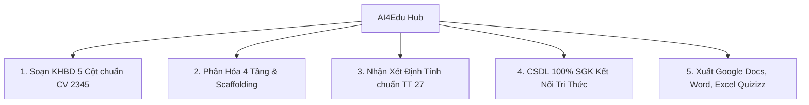

# 📄 Tài Liệu Giới Thiệu & Phiếu Khảo Sát Thử Nghiệm Nền Tảng AI4Edu Hub

> **TRƯỜNG TIỂU HỌC HOÀNG MAI • TỔ CÔNG NGHỆ & ĐỔI MỚI SÁNG TẠO SƯ PHẠM**  
> **Chuyên đề:** Ứng Dụng AI Tạo Sinh Trong Soạn KHBD 5 Cột, Dạy Học Phân Hóa & Đánh Giá Học Sinh Tiểu Học  
> *(Dành cho Cán bộ Quản lý & Giáo viên thử nghiệm đợt 1 - Năm học 2025 - 2026)*

---

## 💌 Thư Ngỏ Gửi Quý Thầy Cô Giáo

Kính gửi Quý Thầy Cô giáo Trường Tiểu học Hoàng Mai,

Nhằm cụ thể hóa chiến lược **Chuyển đổi số giáo dục** và triển khai hiệu quả **Chương trình GDPT 2018**, nhà trường trân trọng giới thiệu chương trình thử nghiệm nền tảng trợ lý trí tuệ nhân tạo **AI4Edu Hub (Phiên bản v2.5)**.

Đây là công cụ được thiết kế chuyên biệt cho giáo viên Tiểu học, giúp tự động hóa khâu chuẩn bị bài dạy chuẩn **Công văn 2345/BGDĐT-GDTH**, thiết kế nhiệm vụ phân hóa 4 tầng và nhận xét học sinh theo **Thông tư 27/2020/TT-BGDĐT**.

Ban Giám hiệu trân trọng gửi tài liệu này đến Quý thầy cô tham gia đợt thử nghiệm đầu tiên nhằm trải nghiệm, đánh giá tính thực tiễn và đóng góp ý kiến hoàn thiện trước khi triển khai tập huấn đại trà toàn trường.

---

## 🌐 I. Thông Tin Truy Cập & Liên Kết Trải Nghiệm

* 🔗 **Địa chỉ ứng dụng trực tuyến:** [https://ai4edu-hm.streamlit.app/](https://ai4edu-hm.streamlit.app/)
* 📖 **Cổng cẩm nang sư phạm trực tuyến:** Tích hợp ngay trên thanh Sidebar và nút mở Dialog tương tác.
* 💻 **Thiết bị hỗ trợ:** Máy tính để bàn (PC), Laptop, Máy tính bảng (iPad/Tablet) hoặc Điện thoại thông minh.

---

## 🚀 II. 5 Tính Năng Đột Phá Hỗ Trợ Giảng Dạy

1. **Soạn Kế Hoạch Bài Dạy (KHBD) 5 Cột Chuẩn Công Văn 2345:**
   * Tự động sinh trọn vẹn giáo án với 4 hoạt động (*Khởi động, Khám phá, Luyện tập, Vận dụng*).
   * Từng hoạt động phân tách rõ 4 bước tổ chức (*Chuyển giao $\rightarrow$ Thực hiện $\rightarrow$ Báo cáo/Thảo luận $\rightarrow$ Kết luận/Nhận định*) kèm mục tiêu, nội dung, sản phẩm kỳ vọng và thử thách mở rộng cho HS khá giỏi.
2. **Phân Hóa Nhiệm Vụ 4 Cấp Độ Nhận Thức (Scaffolding):**
   * Từ 1 bài học SGK, chia tách thành 4 tầng bài tập từ Nhận biết, Thông hiểu đến Vận dụng và Sáng tạo STEM/STEAM.
   * Cung cấp giàn giáo gợi ý từng bước cho học sinh chậm tiến bộ và mở rộng câu hỏi tư duy cho học sinh năng khiếu.
3. **Đánh Giá & Nhận Xét Định Tính Học Sinh Theo Thông Tư 27:**
   * Tự động sinh lời nhận xét cá nhân hóa theo 3 mức độ (*Hoàn thành tốt, Hoàn thành, Cần cố gắng*), chỉ rõ ưu điểm đạt được và biện pháp giúp học sinh khắc phục khó khăn.
4. **Cơ Sở Dữ Liệu 100% Sách Giáo Khoa (Bộ Kết Nối Tri Thức Với Cuộc Sống):**
   * Tích hợp trọn bộ **323 bài học Toán (Lớp 1 đến 5)** và **174 bài học Tiếng Việt (Lớp 1 đến 5)** của NXB Giáo dục Việt Nam.
   * Trích dẫn chính xác từng trang sách, khái niệm, quy tắc gốc nhằm phòng chống hiện tượng bịa đặt thông tin (*Anti-Hallucination*).
5. **Xuất Dữ Liệu Google Docs, Word & Excel Quizizz Chỉ Trong 1 Click:**
   * **Sao chép Google Docs:** Copy bảng 5 cột có màu sắc sang `docs.new` bằng phím tắt `Ctrl + V`.
   * **Xuất File Word (.docx):** Tải về máy tính chỉnh sửa và lưu trữ văn bản.
   * **Xuất File Excel (.xlsx):** Nạp thẳng bộ câu hỏi trắc nghiệm đố vui vào Quizizz / Kahoot.

---

## 🎯 III. Quy Trình 3 Bước Thực Hiện Dành Cho Giáo Viên

* **Bước 1: Thiết Lập Cấu Hình Tại Sidebar (Bên trái):**
  1. Chọn **Khối Lớp** (từ Khối Lớp 1 đến Khối Lớp 5).
  2. Chọn **Môn Học** (Toán học, Tiếng Việt, Khoa học, Tự nhiên & Xã hội...).
  3. Xem các cẩm nang tra cứu và chọn mô hình AI (Khuyên dùng `Gemini 3.5 Flash` - Rất nhanh và ổn định).
* **Bước 2: Chọn Bài Học Từ Danh Mục SGK Chuẩn:**
  1. Chọn **Tập sách** (Tập 1 hoặc Tập 2).
  2. Chọn **Bài học chính thức** từ danh mục thả xuống (Ví dụ: `Bài 18: Góc, góc vuông, góc không vuông`).
  3. Quan sát khung trích dẫn nguyên văn SGK hiển thị tự động để nắm bắt số trang và bài tập mẫu gốc.
  4. Tích chọn `Thử thách HS khá giỏi` để AI bổ sung nhiệm vụ phát triển tư duy nâng cao.
* **Bước 3: Sinh Giáo Án & Đồng Bộ Dữ Liệu:**
  1. Bấm nút **`🚀 Tự Động Sinh Kế Hoạch Bài Dạy 2345`**.
  2. Để đưa vào Google Docs: Bấm nút màu xanh **`📋 BẤM VÀO ĐÂY ĐỂ SAO CHÉP ĐỊNH DẠNG GOOGLE DOCS`** $\rightarrow$ Mở trang `docs.new` $\rightarrow$ Bấm `Ctrl + V`.
  3. Để lưu file Word: Bấm nút **`📥 Tải Kế Hoạch Bài Dạy (.docx)`**.

---

## ⚠️ IV. Nguyên Tắc Sư Phạm & Đạo Đức AI (Chuẩn UNESCO 2024)

1. **Vai trò chủ đạo của Nhà giáo (Teacher-in-the-loop):** AI chỉ là trợ lý hỗ trợ thô; thầy cô giáo giữ vai trò quyết định chuyên môn cao nhất.
2. **Kiểm tra & Thẩm định bắt buộc:** Giáo viên phải đọc duyệt, rà soát lại toàn bộ kiến thức, thuật ngữ khoa học và độ phù hợp lứa tuổi trước khi in ấn hoặc đem vào giảng dạy trên lớp.
3. **Bảo mật thông tin học sinh:** Tuyệt đối không nhập họ tên đầy đủ, ngày sinh, địa chỉ hoặc hình ảnh riêng tư của học sinh lên ứng dụng AI công cộng.
4. **Tính chất thử nghiệm Demo:** Đây là phiên bản phục vụ nghiên cứu sư phạm nội bộ, rất cần sự phản hồi chân thực của thầy cô để tiếp tục hiệu chỉnh.

---

## 📝 V. Phiếu Khảo Sát & Đóng Góp Ý Kiến Thử Nghiệm

*Kính đề nghị Quý Thầy Cô sau khi trải nghiệm hoàn thành phiếu đánh giá dưới đây và gửi lại cho Tổ Chuyên môn Công nghệ:*

| STT | Nội Dung Đánh Giá | Mức Độ Đánh Giá | Ý Kiến Góp Ý / Đề Xuất Cụ Thể |
| :---: | :--- | :--- | :--- |
| **1** | Giao diện & Độ tiện dụng khi thao tác | `[ ] Rất dễ dùng` `[ ] Bình thường` `[ ] Khó dùng` | *(Thầy cô ghi chú thêm...)* |
| **2** | Độ chính xác nội dung SGK Kết nối tri thức | `[ ] Rất chính xác` `[ ] Khá tốt` `[ ] Cần chỉnh sửa` | *(Ghi rõ môn/bài cần chỉnh...)* |
| **3** | Chất lượng Kế hoạch bài dạy 5 cột (CV 2345) | `[ ] Chuẩn sư phạm` `[ ] Dùng tốt` `[ ] Cần bổ sung` | *(Ý kiến về 4 hoạt động/4 bước...)* |
| **4** | Tính hữu ích của Phân hóa nhiệm vụ 4 tầng | `[ ] Rất cần thiết` `[ ] Hữu ích` `[ ] Chưa phù hợp` | *(Ý kiến về thang đo Bloom/Scaffolding)* |
| **5** | Tính năng Sao chép sang Google Docs (`Ctrl + V`) | `[ ] Rất mượt mà` `[ ] Ổn định` `[ ] Gặp lỗi hiển thị` | *(Nhận xét về bảng màu/cột...)* |
| **6** | Đánh giá chung về khả năng áp dụng thực tế | `[ ] Rất ủng hộ` `[ ] Cần cải tiến thêm` `[ ] Chưa sẵn sàng` | *(Đề xuất cho Ban Giám hiệu...)* |

*Hà Nội, ngày ..... tháng ..... năm 2026*  
**GIÁO VIÊN THỬ NGHIỆM ĐÓNG GÓP Ý KIẾN**  
*(Ký và ghi rõ họ tên)*
