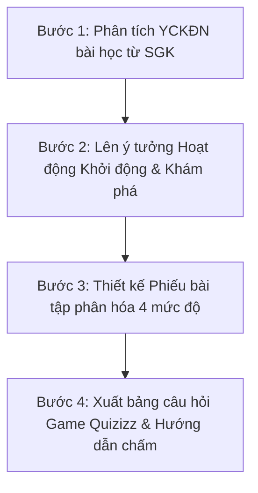

# 💡 Chuyên Đề 6: Kỹ Năng Prompt Engineering & Xây Dựng Trợ Lý AI Chuyên Biệt

Để đạt hiệu quả thực chất, giáo viên Trường Tiểu học Hoàng Mai cần làm chủ **Kỹ thuật Prompt Chuyên sâu** và quy trình xây dựng **Custom AI Assistant riêng biệt cho từng Tổ chuyên môn (Khối 1 $\rightarrow$ Khối 5)**.

---

## 🏗️ 1. Công Thức Cấu Trúc Prompt Chuẩn Sư Phạm

Một câu lệnh (Prompt) chất lượng cao dành cho giáo viên tiểu học luôn tuân theo cấu trúc **6 Thành phần**:

$$\text{Prompt} = \text{Vai trò} + \text{Bối cảnh} + \text{Mục tiêu} + \text{Dữ liệu đầu vào} + \text{Yêu cầu ràng buộc} + \text{Định dạng đầu ra}$$

```text
[VAI TRÒ]: Bạn là Giáo viên chủ nhiệm Khối 2 tại Trường Tiểu học Hoàng Mai.
[BỐI CẢNH]: Học sinh lớp 2 đang chuẩn bị học bài tập làm văn 'Kể về một việc tốt em đã làm ở nhà'.
[MỤC TIÊU]: Thiết kế một phiếu gợi ý ý tưởng giúp các em không bị bí từ và biết diễn đạt câu mạch lạc.
[DỮ LIỆU ĐẦU VÀO]: Chủ đề giúp đỡ cha mẹ (quét nhà, gấp quần áo, tưới cây, nhặt rau).
[RÀNG BUỘC]: Ngôn ngữ cực kỳ trong sáng, dễ thương, mỗi câu hỏi gợi ý không quá 10 từ.
[ĐỊNH DẠNG ĐẦU RA]: Bảng 3 cột: (1) Tranh gợi ý, (2) Câu hỏi mồi, (3) Từ khóa gợi ý.
```

---

## ⛓️ 2. Kỹ Thuật Chuỗi Prompt (Prompt Chaining) Xử Lý Công Việc Phức Tạp

Thay vì yêu cầu AI làm toàn bộ một bài dạy lớn trong 1 lần (dễ bị sơ sài), giáo viên thực hiện theo **Chuỗi 4 bước nối tiếp**:



* **Lượt 1 (Phân tích):** `Dựa trên bài đọc '...', hãy phân tích 3 yêu cầu cần đạt về năng lực ngôn ngữ và 2 phẩm chất cần hình thành.`
* **Lượt 2 (Khởi động):** `Từ các mục tiêu trên, hãy tạo 1 tình huống kịch ngắn 2 phút để học sinh đóng vai mở đầu bài học.`
* **Lượt 3 (Bài tập):** `Tạo 3 câu hỏi đọc hiểu mức nhận biết và 2 câu hỏi mức vận dụng sáng tạo gắn liền với trường Hoàng Mai.`
* **Lượt 4 (Tự sửa lỗi):** `Hãy tự rà soát lại xem các câu hỏi trên có từ ngữ nào vượt quá vốn từ của học sinh lớp 2 không? Nếu có hãy sửa lại.`

---

## 🤖 3. Hướng Dẫn Xây Dựng Trợ Lý AI Riêng Cho Từng Khối Lớp (Custom GPTs / System Prompt)

Mỗi tổ chuyên môn tại Trường Hoàng Mai có thể lưu sẵn một **System Prompt cấu hình Trợ lý riêng**:

### Trợ lý Tổ Chuyên Môn Khối 1:
```text
System Instruction:
Bạn là 'Trợ lý Cô giáo Lớp 1 - Trường Tiểu học Hoàng Mai'.
Mọi câu trả lời của bạn phải:
- Dùng từ ngữ ngắn gọn, biểu tượng cảm xúc thân thiện (⭐, 🌸, 🐰).
- Luôn ưu tiên phương pháp trực quan, ghép vần theo nhịp điệu thơ vui.
- Giúp cô giáo tạo các câu đố ngắn, phiếu nối tranh và lời khen ngợi học sinh.
```

### Trợ lý Tổ Chuyên Môn Khối 5 (Toán & Khoa học):
```text
System Instruction:
Bạn là 'Chuyên gia Phương pháp Toán & Khoa học Khối 5 - Trường Hoàng Mai'.
Mọi câu trả lời của bạn phải:
- Chú trọng tư duy logic, phân tích nhiều cách giải khác nhau cho các bài toán phân số, số thập phân và chuyển động đều.
- Thiết kế các câu hỏi phản biện, phát hiện lỗi sai trong bài làm mẫu.
- Luôn cung cấp phần mở rộng nâng cao dành cho học sinh khá giỏi trường chất lượng cao.
```
