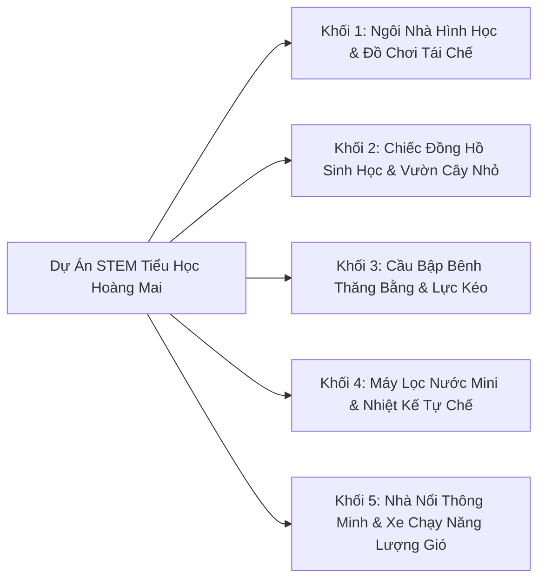

# 🚀 Chuyên Đề 5: Giáo Dục STEM/STEAM & Năng Lực Số (AI Literacy) Cho Học Sinh Tiểu Học

Giáo dục tại **Trường Tiểu học Hoàng Mai** không chỉ sử dụng AI cho giáo viên mà còn **hình thành năng lực số và hiểu biết về AI (AI Literacy)** cho học sinh ngay từ bậc tiểu học theo khuyến nghị của UNESCO.

---

## 🔬 1. Ma Trận Dự Án STEM/STEAM Phân Theo Khối Lớp



### Mẫu Prompt Thiết Kế Kế Hoạch Dự Án STEM Cho Học Sinh Tiểu Học:
```text
Bạn là Chuyên gia Giáo dục STEM/STEAM Tiểu học.
Hãy thiết kế Kế hoạch Dự án STEM mini (thực hiện trong 2 tiết học) cho học sinh Lớp 4 Trường Hoàng Mai:
- Tên dự án: 'Thiết kế Máy lọc nước mini thân thiện với môi trường'
- Tích hợp liên môn: Khoa học (Nước & Sự lọc nước), Toán (Đo thể tích lít/ml), Mỹ thuật (Trang trí bình lọc).
- Nguyên vật liệu dễ tìm, tái chế: Chai nhựa, cát, sỏi, than hoạt tính, bông gòn.
- Kèm theo: Phiếu hướng dẫn thực hành và Tiêu chí đánh giá sản phẩm (Rubric STEM).
```

---

## 🛡️ 2. Giáo Dục Năng Lực Số & Đạo Đức AI Cho Trẻ Em (AI Literacy for Kids)

Học sinh tiểu học có xu hướng coi AI là "người biết tất cả" và dễ tin tưởng tuyệt đối vào thông tin máy tính đưa ra. Giáo viên Hoàng Mai cần rèn luyện 4 kỹ năng cốt lõi:

### 1. Kỹ năng Đặt câu hỏi rõ ràng (Prompting for Kids)
* Dạy trẻ cách mô tả chi tiết điều mình muốn hỏi (Ai? Cái gì? Ở đâu? Để làm gì?).
* Tránh những câu hỏi mơ hồ, cộc lốc.

### 2. Kỹ năng Kiểm chứng thông tin (Fact-checking)
* **Quy tắc "Ba nguồn độc lập":** Khi AI đưa ra một sự thật thú vị, học sinh đối chiếu lại với: (1) Sách giáo khoa, (2) Lời thầy cô giảng, (3) Quan sát thực tế đời sống.

### 3. Nhận biết Giới hạn & Sự ảo giác (Hallucination) của AI
* Giải thích cho học sinh bằng hình tượng trực quan: *"AI giống như một chú vẹt thông minh đọc rất nhiều sách, nhưng chú vẹt không thực sự nhìn thấy thế giới bằng mắt và có thể nói nhầm."*

### 4. Sử dụng AI An toàn & Có trách nhiệm
* Tuyệt đối không chia sẻ họ tên thật, địa chỉ nhà, mật khẩu cho Chatbot AI.
* Không dùng AI để làm bài hộ mà dùng AI để gợi ý cách tư duy.
