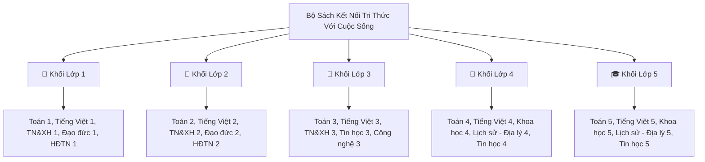

# 📚 Kho Sách Giáo Khoa PDF Điện Tử Lớp 1 - 5 (Bộ Kết Nối Tri Thức)
### Nhà Xuất Bản Giáo Dục Việt Nam — Chương Trình Giáo Dục Phổ Thông 2018

> **Dành cho:** Ban Giám hiệu, Tổ Chuyên môn và Giáo viên Trường Tiểu học Hoàng Mai & Hệ thống K-12  
> **Nguồn tài nguyên:** Nền tảng *Hành Trang Số* (NXBGDVN), *Tập Huấn NXBGDVN* và Kho lưu trữ Google Drive ngành Giáo dục.

---

## 🌐 1. Cổng Tải & Xem Trực Tuyến Chính Thức

| Cổng Học Liệu | Đơn Vị Quản Lý | Tính Năng | Đường Dẫn |
| :--- | :--- | :--- | :--- |
| **Hành Trang Số** | NXB Giáo dục Việt Nam | Đọc online, tương tác hình ảnh, nghe audio bài đọc | [hanhtrangso.nxbgd.vn](https://hanhtrangso.nxbgd.vn/) |
| **Tập Huấn Giáo Viên**| Bộ GD&ĐT & NXBGDVN | Tải trọn bộ bản in PDF chuẩn, SGV và Vở bài tập | [taphuan.nxbgd.vn](https://taphuan.nxbgd.vn/) |
| **Kho Drive Tiểu Học**| Thư viện Học liệu số | Tải nhanh trọn bộ PDF bản đẹp tất cả các lớp | [Thư viện Google Drive Lớp 1 - 5](https://drive.google.com/drive/folders/1OfOZQW4SVQA3VjFp_bkf84U1_zgR473t?usp=sharing) |

---

## 🎒 2. Danh Mục & Liên Kết Tải File PDF Theo Từng Khối Lớp

---

### 🧸 1. Khối Lớp 1
* 📂 **Thư mục Drive tải nhanh Lớp 1:** [Tải Trọn Bộ Lớp 1 (Google Drive)](https://drive.google.com/drive/folders/169N_qc2yAINJ3QLibudU2bQsro0mv26q?usp=sharing)
* **Các môn học chính:**
  1. **Toán 1 (Tập 1 & Tập 2):** GS.TSKH. Hà Huy Khoái (Tổng Chủ biên), PGS.TS. Lê Anh Vinh (Chủ biên).
  2. **Tiếng Việt 1 (Tập 1 & Tập 2):** GS.TS. Bùi Mạnh Hùng (Tổng Chủ biên).
  3. **Tự nhiên và Xã hội 1:** Khám phá gia đình, trường học, thực vật và động vật xung quanh.
  4. **Đạo đức 1 & Hoạt động trải nghiệm 1.**
  5. **Âm nhạc 1, Mĩ thuật 1 & Giáo dục thể chất 1.**

---

### 🎒 2. Khối Lớp 2
* 📂 **Thư mục Drive tải nhanh Lớp 2:** [Tải Trọn Bộ Lớp 2 (Google Drive)](https://drive.google.com/drive/folders/1TUkLbCcAYDYopEsicPR7FweoiHhMwcBK?usp=sharing)
* **Các môn học chính:**
  1. **Toán 2 (Tập 1 & Tập 2):** Phép cộng, phép trừ có nhớ trong phạm vi 100 và 1000; Làm quen phép nhân chia 2 và 5.
  2. **Tiếng Việt 2 (Tập 1 & Tập 2):** Rèn kĩ năng đọc trơn, nghe viết chính tả, mở rộng vốn từ gia đình, trường lớp.
  3. **Tự nhiên và Xã hội 2:** Môi trường sống, thực hành bảo vệ nguồn nước và chăm sóc sức khỏe.
  4. **Đạo đức 2 & Hoạt động trải nghiệm 2.**
  5. **Âm nhạc 2, Mĩ thuật 2 & Giáo dục thể chất 2.**

---

### 📘 3. Khối Lớp 3
* 📂 **Thư mục Drive tải nhanh Lớp 3:** [Tải Trọn Bộ Lớp 3 (Google Drive)](https://drive.google.com/drive/folders/1aLHxjgpYsvcR54JGlYlb7PgW3v3Wkhy0?usp=sharing)
* **Các môn học chính:**
  1. **Toán 3 (Tập 1 & Tập 2 - Trọn bộ 81 bài):** Bảng nhân chia 6, 7, 8, 9; Điểm ở giữa, Trung điểm; Góc vuông (ê-ke); Biểu thức số; Số đến 100 000.
  2. **Tiếng Việt 3 (Tập 1 & Tập 2):** Biện pháp nghệ thuật so sánh, nhân hóa, tập làm văn miêu tả đồ vật/cảnh vật.
  3. **Tự nhiên và Xã hội 3:** Khám phá cơ thể người (tuần hoàn, thần kinh), cơ quan hô hấp, môi trường tự nhiên.
  4. **Tin học 3 (Môn bắt buộc mới):** Làm quen máy tính, thông tin và xử lý thông tin, Internet an toàn.
  5. **Công nghệ 3:** Đồ chơi tự làm, sử dụng thiết bị điện trong gia đình an toàn.
  6. **Đạo đức 3, Hoạt động trải nghiệm 3, Âm nhạc 3, Mĩ thuật 3.**

---

### 🔬 4. Khối Lớp 4
* 📂 **Thư mục Drive tải nhanh Lớp 4:** [Tải Trọn Bộ Lớp 4 (Google Drive)](https://drive.google.com/drive/folders/1EyJEo4JuVxvOBHwdVpwZkbCayvrFwvHu?usp=sharing)
* **Các môn học chính:**
  1. **Toán 4 (Tập 1 & Tập 2):** Khái niệm phân số, bốn phép tính phân số, hình bình hành, hình thoi, tỉ số.
  2. **Tiếng Việt 4 (Tập 1 & Tập 2):** Văn miêu tả cây cối, con vật; Luyện từ và câu (Động từ, Tính từ, Trạng ngữ).
  3. **Khoa học 4:** Sự chuyển thể của chất, vai trò của nước, không khí, năng lượng ánh sáng và nhiệt.
  4. **Lịch sử và Địa lý 4:** Địa phương em, Vùng Trung du và miền núi Bắc Bộ, Vùng Đồng bằng Bắc Bộ.
  5. **Tin học 4 & Công nghệ 4:** Soạn thảo văn bản, lập trình Scratch Jr cơ bản, thiết kế đồ chơi.
  6. **Đạo đức 4, Hoạt động trải nghiệm 4, Âm nhạc 4, Mĩ thuật 4.**

---

### 🎓 5. Khối Lớp 5
* 📂 **Thư mục Drive tải nhanh Lớp 5:** [Tải Trọn Bộ Lớp 5 (Google Drive)](https://drive.google.com/drive/folders/1kw3n1xGwdgCa8RPgLRb_g6d4hADDei98?usp=sharing)
* **Các môn học chính:**
  1. **Toán 5 (Tập 1 & Tập 2 - Trọn bộ 66 bài):** Số thập phân, Tỉ số phần trăm, Diện tích hình thang/hình tròn, Thể tích hình khối ($cm^3, dm^3, m^3$), Toán chuyển động đều ($v = s / t$).
  2. **Tiếng Việt 5 (Tập 1 & Tập 2):** Văn tả người, tả cảnh sinh hoạt; Đại từ, Quan hệ từ, Liên kết câu.
  3. **Khoa học 5:** Biến đổi hóa học, sử dụng năng lượng điện, bảo vệ môi trường và tài nguyên.
  4. **Lịch sử và Địa lý 5:** Lịch sử Việt Nam từ cuối thế kỉ XIX đến nay; Đất nước và con người các châu lục.
  5. **Tin học 5 & Công nghệ 5:** Thực hành phần mềm bảng tính, thiết kế mô hình điện tự động.
  6. **Đạo đức 5, Hoạt động trải nghiệm 5, Âm nhạc 5, Mĩ thuật 5.**

---

## 📥 3. Hướng Dẫn Tải File PDF Trực Tiếp Về Máy Tính

1. **Bước 1:** Bấm vào đường link thư mục Google Drive tương ứng với Khối lớp cần tải ở trên.
2. **Bước 2:** Nhấp chuột phải vào file PDF sách giáo khoa cần dùng (ví dụ: `Toan_3_Tap_1_KNTT.pdf`).
3. **Bước 3:** Chọn **`Tải xuống (Download)`** $\rightarrow$ File PDF chất lượng cao có thể mở trên máy tính, iPad hoặc in ấn cho tổ chuyên môn.
