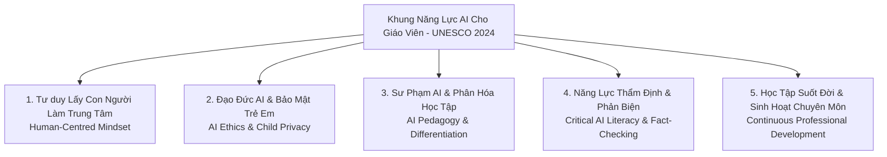

# 🌐 Ứng Dụng AI Trong Giáo Dục Theo Chuẩn UNESCO & Tiêu Chuẩn Quốc Tế

> **Khung Năng Lực AI Dành Cho Giáo Viên & Người Học (UNESCO AI Competency Framework - 2024)**  
> **Tiêu chuẩn ISTE (International Society for Technology in Education) & Hướng dẫn OECD**

---

## ⚠️ 1. Khuyến Cáo Sử Dụng & Trách Nhiệm Sư Phạm (Disclaimer)

> [!IMPORTANT]
> **TÍNH CHẤT TRÌNH DIỄN CÔNG NGHỆ (DEMO) & HỖ TRỢ SƯ PHẠM**
> 
> * **Không thay thế nhà giáo:** Các mô hình trí tuệ nhân tạo (Gemini, Claude, GPT) trong AI4Edu Hub đóng vai trò **Trợ lý Sư phạm Đắc lực**, không thay thế được tư duy chuyên môn, cảm xúc và tương tác sư phạm trực tiếp của người thầy.
> * **Bắt buộc kiểm tra & thẩm định:** Giáo viên giữ vai trò quyết định chuyên môn cao nhất (**Teacher-in-the-loop**) và **bắt buộc phải kiểm tra, rà soát và thẩm định lại toàn bộ tính chính xác khoa học, tính chuẩn mực ngôn ngữ và độ phù hợp lứa tuổi** của các nội dung do AI sinh ra trước khi áp dụng vào giảng dạy thực tế.
> * **Phòng ngừa hiện tượng Ảo giác (Hallucination):** Mặc dù hệ thống đã tích hợp CSDL trích dẫn nguyên văn SGK Kết nối tri thức, giáo viên vẫn cần đối chiếu với tài liệu in chính thống của Nhà xuất bản Giáo dục Việt Nam.

---

## 🏛️ 2. Khung Năng Lực AI Cho Giáo Viên Của UNESCO (2024)

Theo công bố chính thức từ **UNESCO (Tổ chức Giáo dục, Khoa học và Văn hóa của Liên Hợp Quốc)**, năng lực AI của nhà giáo dục bao gồm 5 khía cạnh then chốt:

### 🔹 Trụ cột 1: Tư duy Lấy Con Người Làm Trung Tâm (Human-Centred Mindset)
* AI được sinh ra để phục vụ sự phát triển toàn diện của con người.
* Giáo viên sử dụng AI để giải phóng thời gian khỏi các công việc hành chính lặp lại (soạn giáo án thô, nhập liệu điểm số), từ đó dành nhiều thời gian hơn để:
  - Lắng nghe, thấu cảm và động viên học sinh.
  - Tổ chức các hoạt động trải nghiệm, làm việc nhóm và rèn luyện kỹ năng sống.

### 🔹 Trụ cột 2: Đạo Đức AI & An Toàn Dữ Liệu Học Sinh (AI Ethics & Privacy)
* **Bảo vệ danh tính học sinh:** Tuyệt đối không nhập thông tin nhận dạng cá nhân (PII) như họ tên thật, ngày sinh, địa chỉ, ảnh chân dung hoặc học bạ của học sinh lên các nền tảng AI đám mây công cộng.
* **Chống thiên kiến (Anti-Bias):** Nhận biết và chủ động loại bỏ các định kiến về giới tính, văn hóa hay vùng miền có thể xuất hiện trong dữ liệu huấn luyện của AI.

### 🔹 Trụ cột 3: Sư Phạm Số & Dạy Học Phân Hóa (AI Pedagogy)
* **Cá nhân hóa việc học:** Ứng dụng AI thiết kế ma trận nhiệm vụ phân hóa 4 tầng (Scaffolding):
  - *Tầng 1 & 2:* Cung cấp gợi ý từng bước, sơ đồ tư duy cho học sinh chậm tiến bộ.
  - *Tầng 3 & 4:* Mở rộng nhiệm vụ sáng tạo, thử thách STEM/STEAM cho học sinh năng khiếu.
* **Đánh giá vì sự tiến bộ (Formative Assessment):** Tự động sinh nhận xét định tính chi tiết theo Thông tư 27/2020/TT-BGDĐT.

### 🔹 Trụ cột 4: Năng Lực Thẩm Định & Phản Biện (Critical AI Literacy)
* Rèn luyện kỹ năng đặt câu hỏi truy vấn sắc bén (Prompt Engineering).
* Kiểm tra chéo (Fact-checking) các con số, công thức toán học và sự kiện lịch sử do AI cung cấp.
* Giáo dục học sinh không phụ thuộc mù quáng vào kết quả của các công cụ AI tạo sinh.

---

## 🌍 3. Tiêu Chuẩn Quốc Tế ISTE & OECD

### 🎓 Tiêu chuẩn ISTE (International Society for Technology in Education)
* **Learner (Người học suốt đời):** Giáo viên liên tục cập nhật công nghệ mới.
* **Designer (Nhà thiết kế học tập):** Sử dụng công cụ số để thiết kế các hoạt động học tập tương tác cao (như trò chơi Quizizz, mô phỏng Geogebra).
* **Facilitator (Người điều phối):** Dẫn dắt học sinh trở thành **Nhà kiến tạo số (Digital Creators)**, tự tin sử dụng AI làm công cụ hỗ trợ giải quyết các vấn đề thực tiễn của cuộc sống.

### 📊 Báo Cáo OECD Digital Education Outlook
* Đảm bảo tính công bằng (Equity) trong tiếp cận giáo dục số.
* Phát triển tư duy bậc cao (Higher-Order Thinking Skills): Phân tích, Đánh giá, Sáng tạo theo thang đo Bloom.
