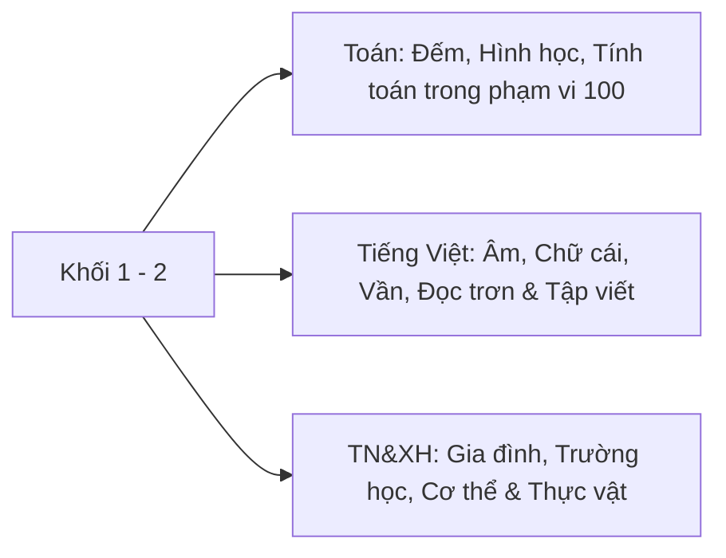
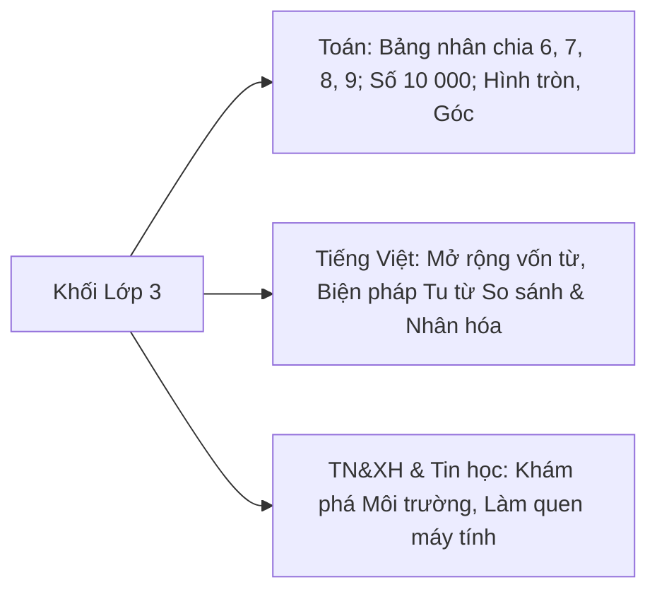
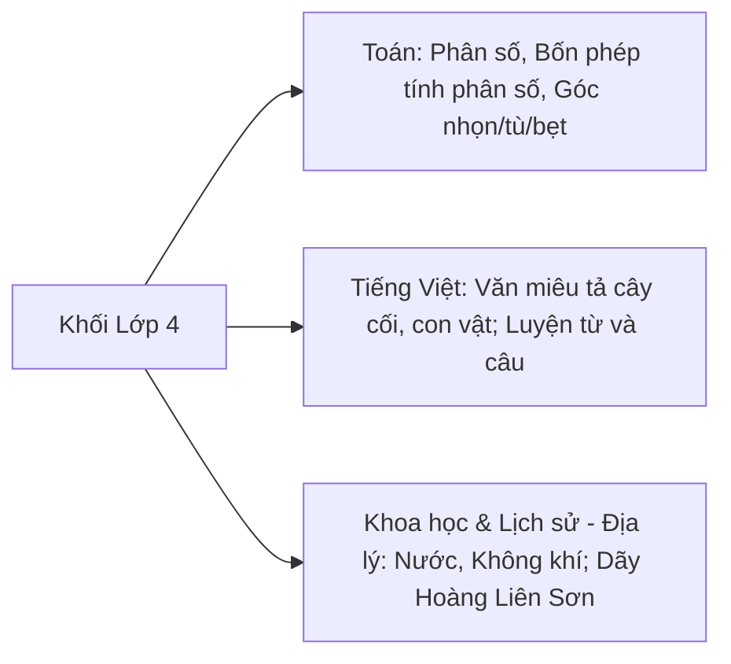
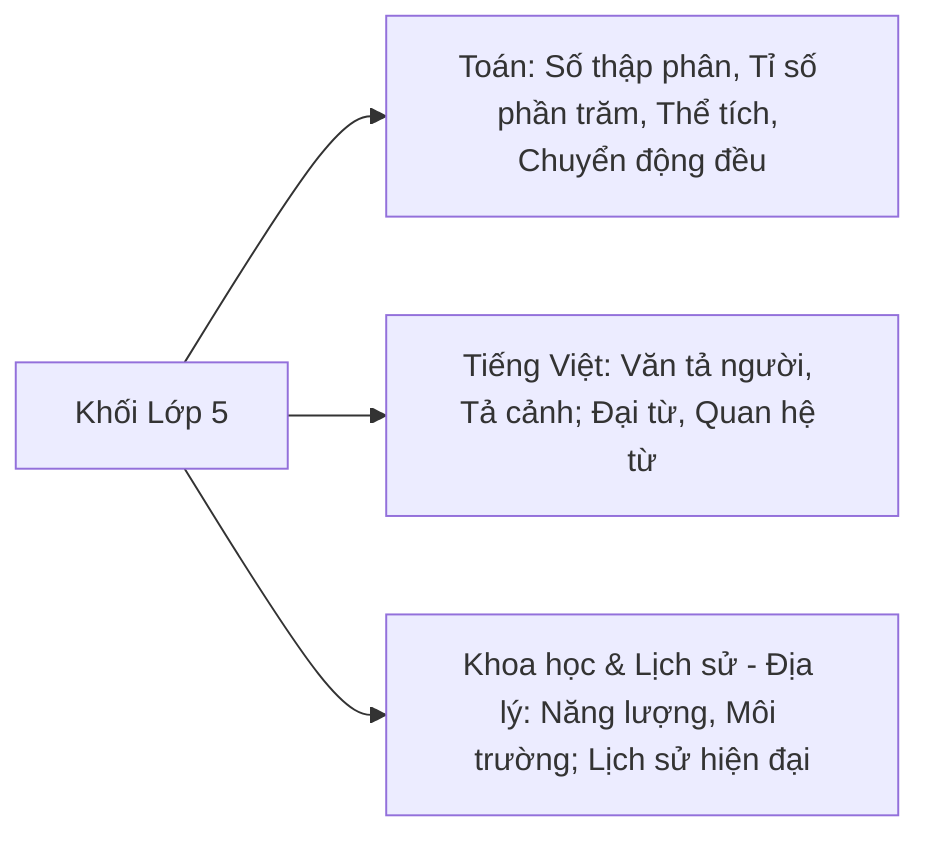

# 🎒 Hướng Dẫn Chi Tiết Theo Từng Khối Lớp & Môn Học

Tài liệu hướng dẫn cụ thể cách áp dụng **AI4Edu Hub** cho từng độ tuổi nhận thức (Lớp 1 $\rightarrow$ Lớp 5) và từng mạch môn học theo Chương trình Giáo dục Phổ thông 2018.

---

## 🧸 1. Khối Lớp 1 & Lớp 2 (Giai Đoạn Nhận Thức Trực Quan - Cảm Tính)

### 📐 Môn Toán Lớp 1 - 2
* **Đặc điểm nhận thức:** Học sinh tư duy chủ yếu qua hình ảnh cụ thể, đồ vật thật (que tính, viên bi, ngón tay).
* **Cách sử dụng AI4Edu:**
  * Tại Tab 1: Chọn bài học như `Phép cộng có nhớ trong phạm vi 20` hoặc `Hình vuông - Hình tam giác`.
  * Tích hợp công cụ trực quan: AI gợi ý sử dụng mô hình que tính, tranh vẽ con vật, trò chơi tiếp sức.
  * Tại Tab 4: Chọn nhân vật trợ giảng **`🐰 Thỏ Trắng Dễ Thương (Lớp 1-2)`** với ngôn ngữ ngắn gọn, giọng điệu vui tươi, nhiều icon động viên.

### 📖 Môn Tiếng Việt Lớp 1 - 2
* **Trọng tâm:** Nhận diện âm vần, ghép vần, đọc đúng tốc độ, viết đúng ô li.
* **Cách sử dụng AI4Edu:**
  * Nhập chủ đề: `Luyện đọc đoạn văn ngắn: Chú mèo mướp` hoặc `Phân biệt l/n, ch/tr`.
  * AI xây dựng bài tập nối từ, điền từ vào chỗ trống và trò chơi đố vui ngữ âm.

---

## 📘 2. Khối Lớp 3 (Giai Đoạn Phát Triển Bảng Cửu Chương & Tư Duy Số Học)

### 📐 Môn Toán Lớp 3 (Tập 1 & Tập 2 - 81 Bài Học)
* **Đặc điểm:** Chuyển từ đếm cộng sang tư duy đại số sơ cấp (Bảng nhân chia 6, 7, 8, 9; Trung điểm; Bán kính - Đường kính; Số có 4, 5 chữ số; Bài toán 2 bước tính).
* **Cách sử dụng:**
  * Chọn trực tiếp từ menu 81 bài học (ví dụ: `Bài 18: Góc, góc vuông, góc không vuông`).
  * Khung **Trích dẫn SGK** sẽ hiển thị chính xác số trang (Tr.54-55) và bài tập mẫu.
  * Tab 2 (Phân hóa): Tự động chia 4 tầng từ nhận biết góc ê-ke $\rightarrow$ đếm góc vuông trong hình phức tạp $\rightarrow$ thiết kế sơ đồ hình học sáng tạo.

---

## 🔬 3. Khối Lớp 4 (Giai Đoạn Hình Thành Khái Niệm Trừu Tượng & Phân Số)

### 📐 Môn Toán Lớp 4
* **Trọng tâm:** Khái niệm phân số, quy đồng mẫu số, rút gọn phân số, tính chất hình bình hành, hình thoi.
* **Cách sử dụng:**
  * Nhập chủ đề: `Rút gọn phân số` hoặc `Diện tích hình bình hành`.
  * AI thiết kế hoạt động chia bánh, gấp giấy trực quan giúp học sinh hiểu sâu bản chất tử số và mẫu số.

### 🔬 Môn Khoa Học & Lịch Sử - Địa Lý Lớp 4
* **Trọng tâm:** Thí nghiệm khoa học (Sự chuyển thể của nước, tính chất không khí), khám phá bản đồ địa lý.
* **Cách sử dụng:** AI sinh kịch bản thí nghiệm 4 bước chuẩn an toàn và câu hỏi kích thích tư duy nghiên cứu nhí.

---

## 🎓 4. Khối Lớp 5 (Giai Đoạn Hoàn Thiện Bậc Tiểu Học & Chuyển Cấp)

### 📐 Môn Toán Lớp 5 (Tập 1 & Tập 2 - 66 Bài Học)
* **Trọng tâm:** Số thập phân, Tỉ số phần trăm, Diện tích hình thang/hình tròn, Thể tích hình hộp chữ nhật/lập phương, Toán chuyển động đều ($v, s, t$).
* **Cách sử dụng:**
  * Chọn từ danh mục 66 bài học SGK Toán 5.
  * Tích hợp thử thách mở rộng cho học sinh khá giỏi: Bài toán chuyển động cùng chiều/ngược chiều có vật cản, bài toán tính lãi suất thực tế.
  * Xuất đề trắc nghiệm Quizizz 10 câu ôn thi chuyển cấp chỉ trong 10 giây!

---

## 📊 5. Bảng Ma Trận Tính Năng Khuyên Dùng Cho Từng Môn Học

| Môn Học | Tab Khuyên Dùng | Học Liệu Đầu Ra | Tính Năng Nổi Bật |
| :--- | :--- | :--- | :--- |
| **Toán học** | Tab 1, Tab 2, Tab 5 | File Word / Google Docs / Excel Quizizz | Tích hợp 100% mục lục SGK, bài toán phân hóa 4 tầng, hình học trực quan |
| **Tiếng Việt** | Tab 1, Tab 3, Tab 4 | File Word / Sổ nhận xét TT 27 | Dàn ý tập làm văn, đoạn văn mẫu phân hóa, nhận xét định tính khích lệ |
| **Khoa học / TN&XH** | Tab 1, Tab 4, Tab 5 | File Word / Trắc nghiệm Game | Kịch bản thí nghiệm STEM mini, câu hỏi gợi mở Socratic |
| **Lịch sử & Địa lý** | Tab 1, Tab 5 | File Word / Trắc nghiệm Game | Dòng thời gian sự kiện, bài tập đọc bản đồ và tư duy phản biện |
| **Tin học & Công nghệ**| Tab 1, Tab 2 | File Word / Dự án số | Nhiệm vụ thực hành trên máy tính, rèn luyện tư duy thuật toán trẻ em |
