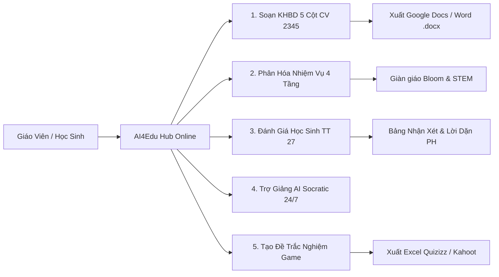

# 📖 Cẩm Nang Hướng Dẫn Sử Dụng AI4Edu Hub
### Hệ Sinh Thái Trợ Lý AI Giáo Dục Đa Mô Hình (Gemini • Claude • GPT)

> **Dành cho:** Cán bộ Quản lý, Tổ trưởng Chuyên môn, Giáo viên Tiểu học & Phụ huynh học sinh  
> **Áp dụng tại:** Trường Tiểu học Hoàng Mai & Hệ thống Giáo dục K-12  
> **Nền tảng trực tuyến:** [https://ai4edu-hm.streamlit.app/](https://ai4edu-hm.streamlit.app/)

---

## 🌟 1. Tổng Quan 5 Trợ Lý AI Chuyên Biệt



---

## 🚀 2. Quy Trình 3 Bước Soạn Bài Chuẩn Sư Phạm

```
[Bước 1: Chọn Khối Lớp & Môn Học] ➔ [Bước 2: Chọn Bài Học Từ SGK] ➔ [Bước 3: Bấm Sinh Bài & Xuất File]
```

### 🔹 Bước 1: Thiết lập cấu hình tại Sidebar (Thanh bên trái)
1. **Phạm vi:** Chọn `🏫 Tiểu học Hoàng Mai (Lớp 1 - 5)` hoặc `🌐 Toàn bộ K-12 (Lớp 1 - 12)`.
2. **Khối Lớp:** Chọn lớp cần giảng dạy (ví dụ: `Khối Lớp 3` hoặc `Khối Lớp 5`).
3. **Môn Học:** Chọn môn học tương ứng (Toán học, Tiếng Việt, Tự nhiên & Xã hội, Khoa học...).
4. **Mô hình AI:** Khuyên dùng `Gemini 3.5 Flash` (Tốc độ cực nhanh, ổn định 100%) hoặc `Claude 3.7 Sonnet` / `GPT-4o`.

---

### 🔹 Bước 2: Chọn bài học chuẩn từ danh mục SGK
* Hệ thống đã tích hợp sẵn **trọn bộ 81 bài học Toán 3** và **66 bài học Toán 5** chuẩn sách *Kết nối tri thức với cuộc sống*.
* Chọn **Tập sách** (Tập 1 hoặc Tập 2) $\rightarrow$ Chọn bài học từ danh sách thả xuống.
* Hệ thống sẽ tự động hiển thị khung **`📖 Trích Dẫn Nguyên Văn Từ SGK`** gồm: *Số trang sách, định nghĩa quy tắc cốt lõi và các bài tập mẫu gốc*.

---

### 🔹 Bước 3: Xuất và đồng bộ học liệu

#### 📋 Cách A: Sao chép sang Google Docs (Khuyên dùng - Nhanh nhất)
1. Bấm nút màu xanh: **`📋 BẤM VÀO ĐÂY ĐỂ SAO CHÉP ĐỊNH DẠNG GOOGLE DOCS`**.
2. Bấm nút: **`🌐 Mở Google Docs Mới (docs.new)`**.
3. Tại trang Google Docs, nhấn **`Ctrl + V`** $\rightarrow$ Kế hoạch bài dạy bảng 5 cột sẽ xuất hiện với đầy đủ kẻ ô, màu sắc tiêu đề chuẩn đẹp 100%!

#### 📥 Cách B: Tải file Word (`.docx`)
* Bấm nút **`📥 Tải File Word (.docx)`** để lưu file về máy tính, sẵn sàng in ấn hoặc nộp tổ chuyên môn.

---

## 🎯 3. Hướng Dẫn Sử Dụng Chi Tiết Từng Tính Năng

* [📘 Hướng dẫn theo từng Khối Lớp & Môn Học (Lớp 1 - 5)](./grade-subject-guide)
* [📑 Hướng dẫn chi tiết Soạn KHBD 5 Cột (Công văn 2345)](./lesson-planning-tutorial)
* [🎯 Hướng dẫn Thiết kế Ma Trận Nhiệm Vụ 4 Tầng Phân Hóa](/hoang-mai-primary/differentiation-advanced)
* [📊 Hướng dẫn Trợ lý Đánh giá & Nhận xét Học sinh (Thông tư 27)](/hoang-mai-primary/assessment-tt27)
* [🛠️ Hướng dẫn Quy trình Công cụ số & Trợ giảng AI](/hoang-mai-primary/digital-toolchain)
* [📐 Tra cứu 81 Bài học Toán 3 & 66 Bài học Toán 5](/hoang-mai-primary/math-grade3-grade5)
