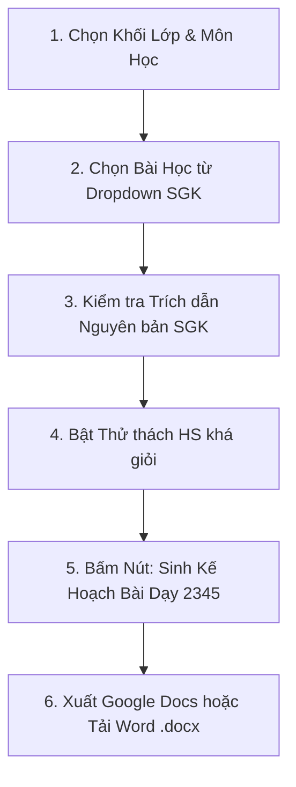

# 📑 Hướng Dẫn Soạn Giáo Án 5 Cột & Xuất File Chuẩn

Hướng dẫn chi tiết từng bước dành cho giáo viên để soạn Kế hoạch bài dạy chuẩn **Công văn 2345/BGDĐT-GDTH**, phân hóa học sinh khá giỏi và xuất ra Google Docs hoặc Microsoft Word giữ nguyên 100% format bảng biểu.

---

## 📋 1. Soạn Kế Hoạch Bài Dạy 5 Cột (Tab 1)



### Chi tiết các bước thực hiện:
1. **Chọn bài học:**
   * Tại mục *Danh sách bài học chính thức*, chọn bài học trong SGK (ví dụ: `Bài 18: Góc, góc vuông, góc không vuông`).
   * Hệ thống tự động mở khung **Trích dẫn nguyên văn từ SGK** với trang sách, định nghĩa và bài tập gốc.
2. **Cấu hình bổ sung:**
   * Tích chọn `Thử thách HS khá giỏi` để AI tích hợp các câu hỏi mở, nhiệm vụ liên môn và học liệu số.
3. **Sinh bài dạy:**
   * Bấm nút **`🚀 Tự Động Sinh Kế Hoạch Bài Dạy 2345`**.
   * Sau 5–10 giây, giáo án 5 cột hoàn chỉnh sẽ xuất hiện gồm:
     * **I. Yêu cầu cần đạt** (Phẩm chất & Năng lực).
     * **II. Đồ dùng dạy học & Học liệu số**.
     * **III. Bảng 5 Cột:** Hoạt động học | Mục tiêu | Nội dung | Sản phẩm | Tổ chức 4 bước (Chuyển giao $\rightarrow$ Thực hiện $\rightarrow$ Báo cáo $\rightarrow$ Kết luận) kèm box *Thử thách mở rộng màu vàng nổi bật*.

---

## 🌐 2. Hướng Dẫn Xuất Sang Google Docs (Không Lỗi Format)

```
[Bấm nút Xanh: Sao Chép Định Dạng] ➔ [Bấm nút: Mở Google Docs Mới] ➔ [Nhấn Ctrl + V để Dán]
```

1. **Bước 1:** Bấm nút màu xanh **`📋 BẤM VÀO ĐÂY ĐỂ SAO CHÉP ĐỊNH DẠNG GOOGLE DOCS`**.
   * Nút sẽ chuyển sang `✅ ĐÃ SAO CHÉP XONG!`.
2. **Bước 2:** Bấm nút **`🌐 Mở Google Docs Mới (docs.new)`**.
3. **Bước 3:** Tại trang Google Docs, nhấn **`Ctrl + V`** (hoặc Chuột phải $\rightarrow$ Dán).
   * **Kết quả:** Toàn bộ bảng 5 cột có kẻ viền, ô tiêu đề màu xanh dương `#0b57d0`, chữ đậm rõ ràng, căn lề chuẩn mực sẽ xuất hiện ngay lập tức!

---

## 🎯 3. Thiết Kế 4 Tầng Nhiệm Vụ Phân Hóa (Tab 2)

Từ 1 đơn vị kiến thức bài học, AI tự động phân tách thành 4 tầng bài tập phù hợp với mọi nhóm học sinh trong lớp:

* 🟢 **Tầng 1 (Cần hỗ trợ):** Có giàn giáo trực quan, mẫu gợi ý từng bước.
* 🔵 **Tầng 2 (Đạt chuẩn):** Bám sát kiến thức nền tảng trong SGK.
* 🟣 **Tầng 3 (Khá):** Vận dụng suy luận 2 bước tính hoặc giải quyết tình huống thực tế.
* 🟠 **Tầng 4 (Giỏi / Nâng cao):** Phát triển tư duy phản biện, bài toán nhiều cách giải, thử thách STEM mini.

---

## 📊 4. Đánh Giá & Nhận Xét Học Sinh Theo Thông Tư 27 (Tab 3)

1. Nhập **Mã học sinh** (Ẩn danh như `HS08`, `HS12` để bảo mật thông tin cá nhân).
2. Chọn **Đợt đánh giá** (Giữa kì I, Cuối kì I, Giữa kì II, Cuối năm).
3. Nhập **Ghi chú quan sát thực tế** của giáo viên.
4. Bấm **`✍️ Tạo Lời Nhận Xét Chuẩn Thông Tư 27`**:
   * Đánh giá môn học theo 3 mức `T` (Hoàn thành Tốt), `H` (Hoàn thành), `C` (Chưa hoàn thành).
   * Đánh giá 3 Năng lực chung, 7 Năng lực đặc thù và 5 Phẩm chất chủ yếu.
   * Lời nhận xét gửi phụ huynh ấm áp, xây dựng và gợi ý 2-3 nhiệm vụ tự học tại nhà.
